# Guía del Parcial 2 · Sistemas Distribuidos
### De RPC/gRPC a MPI: comunicación, organización y procesamiento distribuido

**Cubre:** `07-gRPC-2026`, `08-MOM`, `09-P2P-wn`, `10-mpi-openmp`, tus apuntes del 14/08 al 23/09, las tres grabaciones de clase de MPI y los códigos `Practica.c` y `EjercicioIntegral.c`. Libro de referencia: Tanenbaum y van Steen, *Distributed Systems*, 4.ª edición (DS4).

**Fecha:** Álvaro lo dijo en la clase del 18/09: *"es en la semana 6 y 12, estamos en la semana 10"*. El parcial es la **semana 12**.

> Compañero de esta guía: `repaso-express-parcial2.md`. Esta es la referencia para entender; el express es para la noche anterior y para armar la hoja manuscrita.

## Leyenda

| Marca | Significa |
|---|---|
| 🎯 | Está en la lámina: es lo que se evalúa literalmente |
| 🖊️ | Está en tus apuntes |
| 🎙️ | Lo dijo Álvaro en clase (sacado de la transcripción automática, que tiene ruido) |
| ➕ | Complemento: DS4, el estándar MPI o documentación oficial. Sube la respuesta de "correcta" a "sobresaliente" |
| ⚠️ | Trampa, errata o precisión. Aquí se pierden puntos |
| 🧪 | Lo compilé y ejecuté. La salida que ves es real, no inventada |

## ⚠️ Antes de empezar: a los decks les faltan láminas

No es un detalle menor, porque lo que falta puede estar en el examen.

| Deck | Láminas que tienes | Lo que falta | Qué hice |
|---|---|---|---|
| `07-gRPC` | 1, 4, 14 a 19 | 5 a 13 (casi seguro el RPC clásico, que ya viste en el deck 06) | Sección 1 hace el puente con RPC y RPCL usando tus apuntes |
| `09-P2P-wn` | 1 a 11 (la 11 repetida), 18 a 20 | **12 a 17** | Sección 4 completa Chord con tablas *finger*, búsqueda y BitTorrent desde DS4 |
| `10-mpi-openmp` | 2 a 35, 38, 39 | 36 y 37 | La sección 7 reconstruye la solución MPI de la integral |

Si alguien del curso tiene el deck completo de P2P, vale la pena pedírselo. Las láminas 12 a 17 son justo donde un curso normalmente pone tablas *finger* y búsqueda en Chord.

## Mapa del parcial

La idea que ordena todo: hay **tres preguntas distintas** que un sistema distribuido tiene que responder, y cada deck responde una.

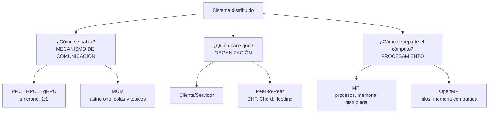

La lámina final del deck P2P lo dice con todas las letras 🎯: *"RPC/gRPC es un mecanismo de comunicación; C/S y P2P son decisiones de organización arquitectónica. No son excluyentes."* Si una pregunta te pone "RPC vs P2P" como si fueran alternativas, es una trampa de categoría.

## Trazabilidad

| Sección | Fuente principal | DS4 |
|---|---|---|
| 1. Puente: RPC y RPCL | `07-gRPC` lám. 14 + apuntes 14/08 y 19/08 | Cap. 4 (RPC) |
| 2. gRPC | `07-gRPC` lám. 15 a 19 | Cap. 4 (RPC) + documentación gRPC |
| 3. MOM | `08-MOM` completo | Cap. 4 (comunicación orientada a mensajes) y Cap. 2 (publish-subscribe) |
| 4. P2P | `09-P2P-wn` | Cap. 2 (arquitecturas descentralizadas) y el capítulo de *Naming* (DHT) |
| 5. Fundamentos de procesamiento | apuntes 16/09 y 23/09 | Cap. 1 (cómputo de alto rendimiento: clústeres) |
| 6. MPI | `10-mpi-openmp` + 3 clases + `Practica.c` | Cap. 4 (MPI) |
| 7. Caso integral | lám. 33 a 35 + `EjercicioIntegral.c` + clase 23/09 | (práctica) |
| 8. OpenMP e híbrido | lám. 3 + apuntes 16/09 | Cap. 3 (hilos) |
| 9. Erratas | todas | |
| 10. Preguntas tipo parcial | todas | |

## Prioridad de estudio

⚠️ Esto es una **estimación**, no una medición: no tengo parciales anteriores de este corte. La hago con tres señales: cuántas clases le dedicó Álvaro, qué dijo en clase que iba a preguntar, y lo que pesó cada tema en los tres parciales anteriores del mismo profesor que analizamos para el primer corte.

| Bloque | Prioridad | Por qué |
|---|---|---|
| MPI (6 y 7) | **Máxima** | Tres clases completas, laboratorio, y en clase anticipó preguntas literales ("¿las colectivas son broadcast o multicast?", "¿qué hace el código? en una frase") |
| MOM (3) | **Alta** | Fue el 17% de las preguntas en esos parciales anteriores, el tema más preguntado, y ahora tiene deck propio |
| Speedup, eficiencia, Amdahl (5) | **Alta** | Es cálculo: se gana o se pierde entero. Amdahl ya salió como pregunta 1 de un parcial |
| gRPC (2) | Media | Deck corto, preguntas de comparación con REST y RPCL |
| P2P (4) | Media | Deck incompleto; Chord y flooding son lo calculable |
| Puente RPC (1) | Baja a media | Depende de si el parcial arranca en gRPC o en RPCL |

---

# 1. Puente: RPC clásico y RPCL

No sabes si el parcial arranca en gRPC o en RPCL. El deck de gRPC incluye una lámina de RPCL (la 14) y tus apuntes de agosto están llenos de RPC, así que esta sección cubre lo mínimo para que ninguna de las dos opciones te agarre en frío. Si ya dominas el primer corte, léela en diagonal y salta a la sección 2.

## 1.1 El problema que RPC resuelve 🎯🖊️

De la lámina: *permitir que un cliente invoque procedimientos, funciones o métodos ubicados en otra parte de la red, de modo que invocar algo remoto se sienta igual que invocar algo local.* El reto para el middleware: lograr esa transparencia **sin que el programador tenga que lidiar a mano con sockets, serialización y fallos de red**.

Tu dibujo del 14/08 lo muestra exacto: `main()` corre en la máquina A (el cliente, en C) y llama a `suma(2, 3)`, que vive en la máquina B (el servidor). Por la red viajan **bytes**, no "un 2 y un 3", y de vuelta llega un 5.

🖊️ Arriba de esa página escribiste *"Cada host → RAM, reloj, CPU"*. Es el origen de todo el curso: cada máquina tiene **su propia memoria y su propio reloj**. No hay memoria compartida, así que no se pueden pasar punteros; y no hay reloj global, así que no hay un "ahora" común. Todo lo que viene después (stubs, colas, MPI) es una manera de convivir con eso.

## 1.2 Stubs, marshalling y serialización 🖊️

- **Stub:** 🖊️ *"se encarga de empaquetar"*. El stub del cliente se hace pasar por la función local; el del servidor desempaqueta y llama a la función real.
- **Serializar:** 🖊️ *"convierte datos u objetos en un formato que puede ser enviado por la red"*.
- **Marshalling:** serializar **más** lo necesario para reconstruir la llamada: qué procedimiento, qué versión, qué parámetros. Serializar es convertir un dato; hacer marshalling es empaquetar una invocación completa.
- **IDL:** 🖊️ *"independiente del lenguaje"*. Se describe la interfaz una sola vez y un compilador genera los stubs.

## 1.3 Por qué serializar no es trivial 🖊️🧪

Anotaste en clase: *"espacio de direccionamiento diferente"* y el ejemplo `0.1 + 0.2 + 0.3` contra `0.3 + 0.2 + 0.1`, con la conclusión *"no es lo mismo"*. Lo comprobé en C:

```
0.1 + 0.2 + 0.3 = 0.60000000000000009
0.3 + 0.2 + 0.1 = 0.59999999999999998
```

La suma en punto flotante **no es asociativa**: el orden cambia los últimos bits. Esto va a reaparecer en MPI (sección 7.7): cuando MPI suma resultados parciales de varios procesos, el orden de la suma depende de cuántos procesos haya, y los últimos decimales cambian. No es un bug, es aritmética de máquina.

Las otras dos razones clásicas por las que serializar es difícil (DS4 cap. 4): distinto **orden de bytes** (big-endian contra little-endian) y distinta **representación** de tipos entre lenguajes y arquitecturas. Por eso existe un formato neutral: XDR en SUN-RPC, Protocol Buffers en gRPC.

## 1.4 RPCL: el IDL de SUN-RPC 🎯

La lámina 14 del deck de gRPC:

```c
struct in {
  int a;
  int b;
};

program CALCP {
  version CALCV {
    int sumar(in) = 1;
    int restar(in) = 2;
    int multiplicar(in) = 3;
    int dividir(in) = 4;
  } = 1;
} = 0x30000864;
```

Cómo leerlo, de adentro hacia afuera:

| Nivel | Valor | Qué identifica |
|---|---|---|
| Procedimiento | `= 1`, `= 2`, `= 3`, `= 4` | Qué función se llama |
| Versión | `= 1` | Qué versión de la interfaz (permite convivir v1 y v2) |
| Programa | `= 0x30000864` | Qué servicio, en toda la máquina |

Una llamada RPC queda identificada por la tripleta **(programa, versión, procedimiento)**. Tu apunte lo resume: *"RPC (LAN): programa, versión"*.

➕ **¿Por qué `struct in` y no `sumar(int a, int b)`?** En el RPC clásico de SUN cada procedimiento recibe **un solo argumento** y devuelve un solo resultado. Para mandar dos enteros hay que envolverlos en una estructura. (Con `rpcgen -N` se permiten varios, pero el estilo clásico es el de la lámina.)

➕ **¿Por qué `0x30000864`?** 🖊️ Anotaste *"1 símbolo hexa vale 4 bits"*: ocho símbolos hexadecimales son 32 bits, el tamaño del número de programa. Los números se reparten por rangos (RFC 5531): de `0x00000000` a `0x1FFFFFFF` los asigna IANA para servicios conocidos (NFS, por ejemplo), y de `0x20000000` a `0x3FFFFFFF` los define el administrador local. `0x30000864` cae en el rango para servicios propios, que es donde debe ir una calculadora de clase.

## 1.5 El portmapper: la secretaria del consultorio 🖊️

Tu página del 19/08 tiene la analogía de Álvaro: el **servidor es el doctor**, el **cliente es el paciente** y el **portmapper es la secretaria**. El paciente no sabe en qué consultorio (puerto) atiende el doctor; la secretaria sí, porque el doctor se lo dijo al llegar.

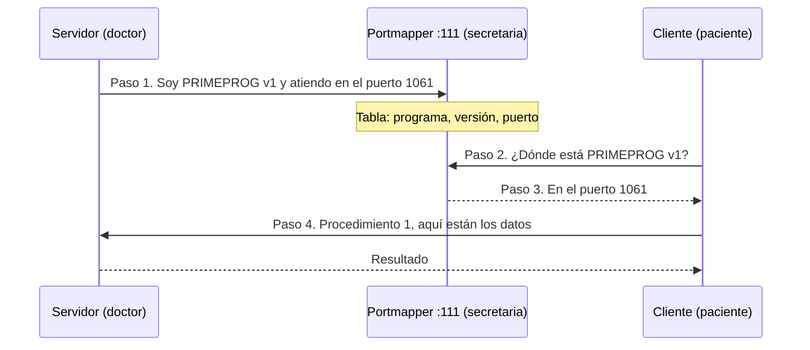

Lo que tienes que poder decir:
- El portmapper escucha en el **puerto 111**, que es fijo y conocido. Todo lo demás es dinámico.
- El portmapper y el servidor viven en la **misma máquina** (tu recuadro de abajo lo dibuja así: una caja con PORTMAPPER y SERVIDOR, otra con CLIENTE).
- ➕ `rpcbind` es el sucesor moderno de `portmap`: soporta IPv6 y es obligatorio con TI-RPC (`libtirpc`) en Ubuntu reciente.

## 1.6 Del `.x` al ejecutable 🖊️

Tu diagrama *"EJM RPCL"* del laboratorio:

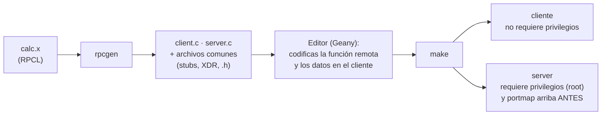

⚠️ **El orden importa.** Si el servidor arranca antes que `portmap`/`rpcbind`, el paso 1 (registrarse) falla y el servidor no queda localizable. Es la versión técnica de "el doctor llegó y no había secretaria a quién avisarle".

🖊️ También anotaste *"Argp → puntero"*: `char **argv` es un puntero a punteros, un vector de cadenas con los parámetros de la línea de comandos. Álvaro lo repitió en la clase de MPI porque `MPI_Init(&argc, &argv)` recibe justamente eso.

## 1.7 Semánticas de ejecución ante fallos 🖊️➕

Tu apunte deja el título *"Tipos de semántica de ejecución"* sin desarrollar. En una llamada local la función se ejecuta exactamente una vez. En una remota, si no llega respuesta, el cliente **no puede saber** si el servidor ejecutó o no. De ahí las semánticas (DS4 cap. 4):

| Semántica | Qué garantiza | Cómo se logra | Riesgo |
|---|---|---|---|
| *Maybe* | Nada: 0 o 1 veces | Enviar y no reintentar | Pérdida silenciosa |
| *At least once* | 1 o más veces | Reintentar hasta tener respuesta | Duplicados: solo seguro si la operación es **idempotente** |
| *At most once* | 0 o 1 veces | Reintentar pero el servidor filtra duplicados por ID | Puede no ejecutarse |
| *Exactly once* | Exactamente 1 | Imposible en general si el servidor puede caerse | (es el ideal inalcanzable) |

Guárdala: la misma tabla vuelve en MOM (sección 3.12), porque un broker de mensajes enfrenta el mismo dilema con los *acks*.

---

# 2. gRPC

## 2.1 El péndulo: de RPC a REST y de vuelta a RPC 🎯

La lámina 15 cuenta una historia de cuatro épocas. Entender **por qué murió cada una** es lo que te deja responder cualquier pregunta de comparación.

| Época | Cómo era | Por qué la reemplazaron |
|---|---|---|
| **RPC / RMI / CORBA** | Binario, fuertemente tipado | Atado a la plataforma: RMI solo habla Java con Java; CORBA era complejo; sus puertos no pasaban los firewalls de Internet |
| **XML-RPC / SOAP** | XML sobre HTTP | Pasaba firewalls (usa HTTP) y era interoperable, pero verboso y pesado de procesar |
| **REST** | Recursos + JSON sobre HTTP | Simple, legible, estándar de facto de la web. Pero sin contrato tipado y con texto que hay que parsear |
| **gRPC** | Stubs otra vez, pero con HTTP/2 + protobuf | Vuelve la eficiencia y el tipado sin atarse a un lenguaje |

🎯 La frase de la lámina: *"El péndulo vuelve a RPC, pero esta vez sin los problemas de acoplamiento que hundieron a RMI y CORBA."*

⚠️ **Precisión que te distingue.** gRPC elimina el acoplamiento **de plataforma y de lenguaje** (un cliente en Python llama a un servidor en Go). **No** elimina el acoplamiento **temporal**: sigue siendo petición-respuesta, y si el servidor está caído la llamada falla igual que en SUN-RPC. Tampoco elimina el acoplamiento **de contrato**: ambos lados dependen del mismo `.proto`. Si te preguntan qué acoplamiento resuelve gRPC, responde "el de plataforma"; si te preguntan si gRPC es asíncrono y desacoplado como un MOM, la respuesta es no.

## 2.2 Qué es gRPC 🎯

- Framework de RPC de **código abierto, desarrollado por Google**.
- Transporte: **HTTP/2**. IDL: **Protocol Buffers** (protobuf).
- Comunicación eficiente, soporte multi-lenguaje, **streaming**, generación automática de código.

🖊️ Tu apunte del 14/08 los contrastó así: *"RPC (LAN): programa, versión. gRPC (WAN): protocolo. Lenguaje: C contra Python/C#"*. El RPC de SUN nació para redes locales y un solo ecosistema; gRPC nació para microservicios que hablan entre centros de datos y en cualquier lenguaje.

## 2.3 Por qué HTTP/2 y no HTTP/1.1 ➕

| Característica de HTTP/2 | Qué le da a gRPC |
|---|---|
| **Multiplexación** | Muchas llamadas simultáneas por **una sola conexión TCP**, sin esperar a que termine la anterior |
| **Framing binario** | Nada de texto que parsear en las cabeceras |
| **Compresión de cabeceras** (HPACK) | Llamadas repetidas al mismo servicio casi no pagan cabeceras |
| **Streams bidireccionales** | Cliente y servidor pueden enviar mensajes a la vez: es lo que habilita el streaming |
| **Trailers** | gRPC manda el código de estado *al final* del stream |

⚠️ Ese último punto es la razón por la que **un navegador no puede llamar a gRPC directamente**: las APIs del navegador no exponen los trailers de HTTP/2. Existe gRPC-Web, que necesita un proxy intermedio. Por eso la lámina insiste en que para APIs públicas consumidas desde navegadores, REST sigue siendo excelente.

## 2.4 Protocol Buffers: el IDL y el formato 🎯➕🧪

```protobuf
syntax = "proto3";

service Greeter {
  rpc SayHello (HelloRequest) returns (HelloReply);
}

message HelloRequest { string name = 1; }
message HelloReply   { string message = 1; }
```

⚠️ **El `= 1` no es un valor por defecto.** Es el **número de campo**: la identidad del campo en el cable. En los bytes no viaja la palabra `name`, viaja el número 1. Es la misma idea que el `= 1` de los procedimientos en RPCL: un número identifica, no un nombre.

Serialicé el `HelloRequest(name="Mundo")` de la lámina con la librería real:

```
protobuf: 7 bytes   0a 05 4d 75 6e 64 6f
JSON:    16 bytes   {"name":"Mundo"}
```

`0a` codifica "campo 1, tipo cadena"; `05` es la longitud; lo demás es "Mundo". El nombre del campo no viaja.

⚠️ **Pero "binario" no significa "siempre más pequeño".** Con el mensaje de la calculadora, `Operandos(a=7, b=2)` con campos `double`, protobuf ocupa **18 bytes** y el JSON `{"a":7.0,"b":2.0}` ocupa **17**: cada `double` en protobuf son 8 bytes fijos. La ventaja real de protobuf no es solo el tamaño: es que **no hay que parsear texto**, que el esquema está **tipado** y que evoluciona sin romper clientes. Si una opción del parcial dice "protobuf siempre produce mensajes más pequeños que JSON", es falsa.

➕ **Evolución del esquema.** Agregas un campo con un número nuevo y los clientes viejos simplemente lo ignoran; nunca reutilizas un número ya usado. Compáralo con RPCL, donde para cambiar la interfaz subes la **versión completa** (`version CALCV = 2`). Protobuf versiona por campo; RPCL versiona por interfaz.

## 2.5 Los cuatro tipos de llamada ➕

La lámina dice *"streaming: sí, nativo"*. Concretamente existen cuatro formas, y se declaran con la palabra `stream`:

| Tipo | Declaración | Ejemplo |
|---|---|---|
| Unario | `rpc Sumar (Op) returns (Res);` | La calculadora: una pregunta, una respuesta |
| Streaming del servidor | `rpc Precios (Accion) returns (stream Precio);` | Cotizaciones en vivo, barra de progreso |
| Streaming del cliente | `rpc Subir (stream Lectura) returns (Resumen);` | Un sensor manda mil lecturas y recibe un resumen |
| Bidireccional | `rpc Chat (stream Msg) returns (stream Msg);` | Chat, juego en línea |

REST solo tiene naturalmente el primero. Por eso en la tabla de la lámina REST aparece con streaming "limitado".

## 2.6 Del `.proto` al código: los cuatro pasos 🎯

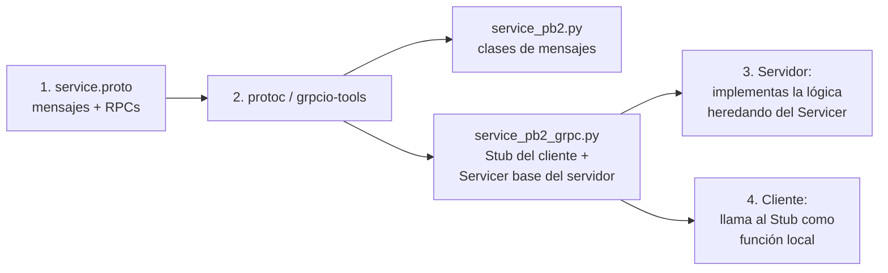

El comando de la lámina:

```bash
python -m grpc_tools.protoc -I. --python_out=. --grpc_python_out=. service.proto
```

`-I.` dice dónde buscar el `.proto`; `--python_out` genera los mensajes (`service_pb2.py`); `--grpc_python_out` genera el stub y la clase base del servidor (`service_pb2_grpc.py`). Es el equivalente exacto de `rpcgen` en SUN-RPC.

## 2.7 El servidor y el cliente, línea por línea 🎯➕

```python
# grpc-server.py
class GreeterServicer(service_pb2_grpc.GreeterServicer):
    def SayHello(self, request, context):
        return service_pb2.HelloReply(message=f"Hola, {request.name}!")

server = grpc.server(futures.ThreadPoolExecutor(max_workers=10))
service_pb2_grpc.add_GreeterServicer_to_server(GreeterServicer(), server)
server.add_insecure_port("[::]:50051")
server.start()
server.wait_for_termination()
```

| Línea | Qué significa | Por qué importa |
|---|---|---|
| `class ...(GreeterServicer)` | Heredas de la clase **generada** | Tú solo escribes la lógica; el desempaquetado ya está hecho |
| `ThreadPoolExecutor(max_workers=10)` | Un **pool de 10 hilos** atiende las llamadas | Hasta 10 peticiones a la vez: es el modelo *dispatcher/worker* de servidores multihilo (DS4 cap. 3) |
| `"[::]:50051"` | Escucha en todas las interfaces, puerto 50051 | `[::]` es "cualquier dirección" en IPv6 |
| `add_insecure_port` | **Sin TLS** | Aceptable en laboratorio; en producción se usa `add_secure_port` con certificados |
| `start()` y `wait_for_termination()` | `start` no bloquea; el segundo mantiene vivo el proceso | Sin la última línea el programa terminaría de inmediato |

```python
# grpc-client.py
channel = grpc.insecure_channel("localhost:50051")
stub = service_pb2_grpc.GreeterStub(channel)
response = stub.SayHello(service_pb2.HelloRequest(name="Mundo"))
print(response.message)
```

`stub.SayHello(...)` **se ve como una función local**: esa es la transparencia de acceso que prometía la primera lámina del deck.

⚠️ **Pregunta de comparación probable: ¿dónde quedó el portmapper?** En gRPC **no existe**. El cliente tiene que conocer de antemano `host:puerto` (aquí, `localhost:50051`). El descubrimiento se delega a lo que haya alrededor: DNS, configuración, o el descubrimiento de servicios de Kubernetes. En SUN-RPC el puerto era dinámico y lo resolvía el portmapper en el 111; en gRPC el puerto es fijo y lo resuelve la infraestructura.

## 2.8 El laboratorio: calculadora distribuida 🎯🧪

La lámina 19 pide una calculadora en Python con suma, resta, multiplicación y división (repo `github.com/aospina/gRPC`). No tengo tu repo, así que la construí desde cero para verificar que el flujo funciona; úsala para contrastar con la del profe.

```protobuf
syntax = "proto3";
package calculadora;

service Calculadora {
  rpc Sumar       (Operandos) returns (Resultado);
  rpc Restar      (Operandos) returns (Resultado);
  rpc Multiplicar (Operandos) returns (Resultado);
  rpc Dividir     (Operandos) returns (Resultado);
}

message Operandos { double a = 1; double b = 2; }
message Resultado { double valor = 1; }
```

Compárala con el `.x` de la sección 1.4: es la **misma interfaz**. `struct in` pasa a ser `message Operandos`; `program CALCP` pasa a ser `service Calculadora`; y los números de procedimiento desaparecen porque gRPC identifica cada método por su nombre (`/calculadora.Calculadora/Sumar`).

El servidor solo necesita un cuidado especial en la división:

```python
def Dividir(self, req, ctx):
    if req.b == 0:
        ctx.abort(grpc.StatusCode.INVALID_ARGUMENT, "División por cero")
    return calc_pb2.Resultado(valor=req.a / req.b)
```

Salida real del cliente (con `timeout=2` en cada llamada):

```
7 + 2 = 9.0
7 / 2 = 3.5
7 / 0 -> INVALID_ARGUMENT | División por cero
```

**La lección de diseño:** el error se valida en el servidor y viaja como un **código de estado** estándar, no como un número mágico dentro del resultado. En tu práctica de RPC con vectores binarios tuviste que inventar un campo `codigo` en la estructura de respuesta; gRPC ya trae ese mecanismo.

## 2.9 Deadlines y códigos de estado ➕

El `timeout=2` del cliente es un **deadline**: si en 2 segundos no hay respuesta, la llamada termina con `DEADLINE_EXCEEDED`. Códigos que conviene reconocer: `OK`, `INVALID_ARGUMENT`, `NOT_FOUND`, `DEADLINE_EXCEEDED`, `UNAVAILABLE` (servidor caído o inalcanzable), `UNIMPLEMENTED`.

⚠️ Aquí regresa la sección 1.7: cuando una llamada termina en `DEADLINE_EXCEEDED`, el cliente **no sabe** si el servidor alcanzó a ejecutarla. Reintentar un `Sumar` es inofensivo; reintentar un "transferir dinero" no. La tecnología cambió; el problema de las semánticas de fallo es exactamente el mismo.

## 2.10 Las dos tablas de comparación

**gRPC contra REST** (lámina 16, con precisión):

| | gRPC | REST |
|---|---|---|
| Transporte | HTTP/2 | HTTP/1.1 🎯 (➕ también funciona sobre HTTP/2; la lámina simplifica) |
| Formato | Protobuf, binario | JSON, texto |
| Contrato | Obligatorio (`.proto`) | Opcional (OpenAPI) |
| Velocidad | Mayor | Menor |
| Streaming | Nativo, 4 modos | Limitado |
| Navegador | Solo con gRPC-Web y proxy | Directo |
| Mejor para | Microservicios internos de alto rendimiento 🎯 | APIs públicas orientadas a humanos y navegadores 🎯 |

⚠️ La comparación mezcla categorías: REST es un **estilo arquitectónico**, gRPC es un **framework**. Si hay una pregunta abierta, decirlo suma.

**SUN-RPC (RPCL) contra gRPC** (síntesis propia para el puente):

| | SUN-RPC | gRPC |
|---|---|---|
| IDL | RPCL (`.x`) | Protobuf (`.proto`) |
| Compilador | `rpcgen` | `protoc` |
| Serialización | XDR | Protobuf |
| Transporte | TCP o UDP directo | HTTP/2 sobre TCP |
| Identificación | (programa, versión, procedimiento) numéricos | `paquete.Servicio/Método` por nombre |
| Descubrimiento | Portmapper/rpcbind en el puerto 111 | Dirección conocida, DNS o *service discovery* |
| Versionado | Por interfaz completa | Por campo |
| Lenguajes | Principalmente C | Multi-lenguaje |
| Acoplamiento temporal | Sí | **Sí** (ambos son síncronos) |

---

# 3. MOM: Message-Oriented Middleware

## 3.1 Definición 🎯

> Middleware que habilita el envío y recepción de mensajes entre procesos distribuidos. La comunicación es **asíncrona**: quien envía no espera bloqueado a que el receptor procese el mensaje. Usa un mecanismo de **store-and-forward**: el mensaje se almacena (temporal o persistentemente) hasta ser entregado. Productor y consumidor quedan **desacoplados en tiempo, espacio y ritmo de procesamiento**.

Tres palabras que tienes que poder explicar sin mirar: **asíncrono**, **store-and-forward**, y **los tres desacoples**.

## 3.2 Los tres desacoples, uno por uno 🎯➕

La analogía de Álvaro, que usó en varias clases: **RPC es una llamada telefónica; MOM es el correo electrónico.** En el teléfono los dos tienen que estar al mismo tiempo, tú sabes a quién llamas, y la conversación va al ritmo de ambos. En el correo, nada de eso.

| Desacople | Pregunta que responde | En RPC | En MOM |
|---|---|---|---|
| **Tiempo** | ¿Tienen que estar vivos a la vez? | Sí | No: el mensaje espera en el broker |
| **Espacio** | ¿El emisor conoce al receptor? | Sí: dirección e interfaz | No: solo conoce la cola o el tópico |
| **Ritmo** (sincronización) | ¿Tienen que ir a la misma velocidad? | Sí: el cliente espera cada respuesta | No: la cola absorbe la diferencia |

El tercero es el que menos gente explica y el que más vale en la industria. **Ejemplo:** en un Black Friday, la tienda recibe 1.000 pedidos por segundo y el servicio de pagos procesa 200. Con RPC, 800 peticiones por segundo fallarían o harían *timeout*. Con una cola, los pedidos se acumulan y pagos los drena a su ritmo; los clientes ven "pedido recibido" al instante y el cobro llega unos minutos después. La cola funciona como un **amortiguador**.

## 3.3 RPC contra MOM 🎯

| RPC (síncrono) | MOM (asíncrono) |
|---|---|
| El cliente **se bloquea** esperando la respuesta | El productor **continúa** sin esperar al consumidor |
| Cliente y servidor **activos al mismo tiempo** | No necesitan estar activos simultáneamente |
| **Acoplamiento fuerte:** el cliente conoce al servidor (dirección, interfaz) | **Acoplamiento débil:** el productor solo conoce la cola o el tópico |
| Un fallo del servidor **bloquea o falla** la llamada | Si el consumidor falla, **el mensaje espera** en la cola: mayor resiliencia |

➕ **Lo que la tabla no dice (el costo).** MOM no es gratis: la entrega es **eventual**, no inmediata; no hay una respuesta natural (si la necesitas, hay que montarla con una cola de respuesta y un identificador de correlación); y el broker es **un componente más** que operar y que, si no se replica, se convierte en el nuevo punto único de fallo. Por eso existen las *quorum queues* de la sección 3.14.

## 3.4 Dónde se usa 🎯

1. **Correo electrónico:** el primer MOM y el más masivo. SMTP almacena y reenvía entre servidores hasta la entrega.
2. **Integración empresarial (EAI):** conectar sistemas heredados y aplicaciones distintas sin acoplarlas directamente.
3. **Notificaciones y eventos:** alertas, confirmaciones, cambios de estado entre microservicios.
4. **IoT y captura masiva de datos:** miles de sensores publicando eventos que se procesan de forma asíncrona (streaming).

🎙️ En la clase de MPI, Álvaro contó cómo guarda un servidor de correo cada mensaje: **una carpeta en disco** con un índice y los adjuntos como archivos. Su punto: por eso la comunicación con búfer es más lenta. **Escribir en disco es órdenes de magnitud más lento que en RAM**, y un MOM persistente paga ese costo a cambio de no perder mensajes.

## 3.5 Los elementos de un MOM 🎯

| # | Elemento | Qué es |
|---|---|---|
| 1 | **Productor** | Proceso que crea y envía mensajes hacia una cola o un tópico |
| 2 | **Mensaje** | Unidad de datos con **encabezado** (metadatos) y **cuerpo** (*payload*) |
| 3 | **Cola / Tópico** | Canal donde se almacenan los mensajes hasta ser consumidos |
| 4 | **Consumidor** | Proceso que recibe y procesa los mensajes disponibles |

➕ Falta uno que la lámina da por supuesto: el **broker**, el servidor que aloja las colas y tópicos (RabbitMQ, Kafka). Productor y consumidor nunca se hablan directamente; ambos hablan con el broker.

## 3.6 Los dos modelos de mensajería 🎯

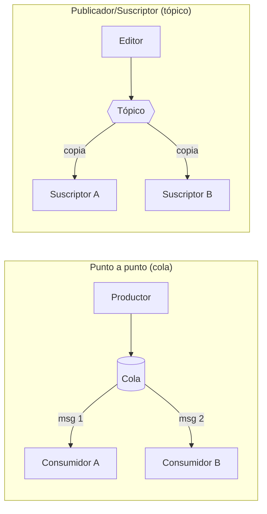

| | Punto a punto (colas) | Publicador/Suscriptor (tópicos) |
|---|---|---|
| Cardinalidad | Cada mensaje lo procesa **un único consumidor** | Cada mensaje llega a **todos** los suscriptores (1:N) |
| Entre consumidores | **Compiten** por los mensajes | Cada uno recibe su **copia** (*fan-out*) |
| Qué conoce el emisor | El **nombre de la cola** destino | Solo el tópico; **no conoce** a los suscriptores |
| Sirve para | **Repartir trabajo:** colas de tareas, procesamiento de órdenes | **Difundir eventos:** notificaciones, actualizaciones de estado |

⚠️ **Tres "punto a punto" distintos en el mismo parcial.** En MOM, "punto a punto" es **el modelo de colas**. En MPI, "punto a punto" es **`MPI_Send`/`MPI_Recv` entre dos procesos**. Y P2P es **peer-to-peer**, una arquitectura. Lee qué deck está evocando la pregunta antes de responder.

## 3.7 Colas en detalle 🎯➕

De la lámina 7:
- Estructura tradicionalmente **FIFO**.
- Cada cola tiene atributos propios: **nombre, tamaño máximo, política de persistencia**.
- Puede ser **dedicada** (un solo consumidor) o **compartida** (varios consumidores compiten).
- Con varios consumidores, cada mensaje llega a uno solo, en **round-robin**.
- Habilita comunicación asíncrona **incluso si el consumidor está caído**: el mensaje simplemente espera.

➕ **Por qué la cola compartida importa tanto:** es la forma más simple de **escalar horizontalmente** un servicio. Si los pedidos se acumulan, agregas un tercer consumidor a la misma cola y la carga se reparte sola, sin tocar al productor. Se llama patrón *competing consumers*.

⚠️ **La cola es FIFO, el procesamiento no necesariamente.** Con dos consumidores, A toma el mensaje 1 y B el 2; si B es más rápido, el 2 termina **antes** que el 1. Y si A se cae sin confirmar, el 1 vuelve a la cola y se entrega después del 3. "La cola es FIFO, luego el sistema procesa en orden" es un razonamiento que **suena bien y es falso** con varios consumidores.

## 3.8 Publish/Subscribe en detalle 🎯

- Relación entre editores y suscriptores: **1:N, N:N o N:1** según el caso.
- **Modelo push:** el broker empuja el mensaje al suscriptor apenas llega.
- **Modelo pull:** el suscriptor consulta activamente si hay mensajes nuevos.
- El editor publica sin saber **quién ni cuántos** están suscritos.

Y la arquitectura (lámina 9): los publicadores envían eventos al **bus o broker**, que se encarga del **enrutamiento, filtrado y entrega** según tópico o *routing key*; los suscriptores se registran **por interés** (tópico, patrón o clave). 🎯 La frase clave: *"este desacople es lo que permite agregar o quitar consumidores sin tocar a los publicadores."*

➕ **Push contra pull, cuándo cada uno.** Push da menor latencia, pero puede **ahogar** a un consumidor lento. Pull deja que el consumidor marque su ritmo (desacople de ritmo en estado puro), a cambio de consultar aunque no haya nada. RabbitMQ es push por defecto; Kafka es pull (sección 3.13).

## 3.9 Cómo enruta un broker AMQP: los *exchanges* 🎯➕

La lámina 10 menciona que AMQP enruta "vía exchanges: direct, fanout, topic, headers". En RabbitMQ el productor **nunca publica directamente en una cola**: publica en un *exchange* con una *routing key*, y el exchange decide a qué colas copia el mensaje.

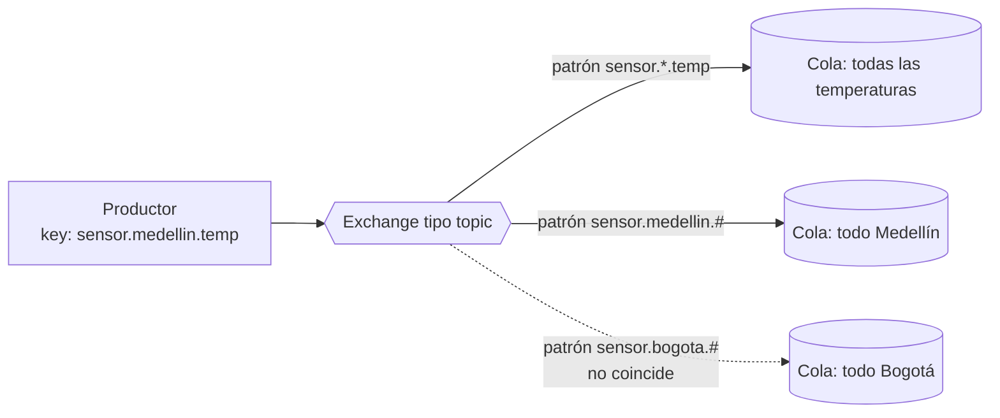

| Exchange | Regla | Equivale a |
|---|---|---|
| **direct** | La key debe ser **igual** a la del enlace | Cola con nombre específico |
| **fanout** | Ignora la key, copia a **todas** las colas enlazadas | Tópico puro, difusión |
| **topic** | Coincidencia por patrón: `*` = exactamente una palabra, `#` = cero o más | Suscripción por interés |
| **headers** | Decide por los encabezados del mensaje, no por la key | Filtrado por contenido |

Con este mecanismo, colas y tópicos no son dos productos distintos: son **dos configuraciones** del mismo broker.

## 3.10 La progresión de la clase: RPC, cola, tópico 🖊️🎙️

Álvaro construyó el tema en tres pasos, y cada paso **elimina una restricción**:

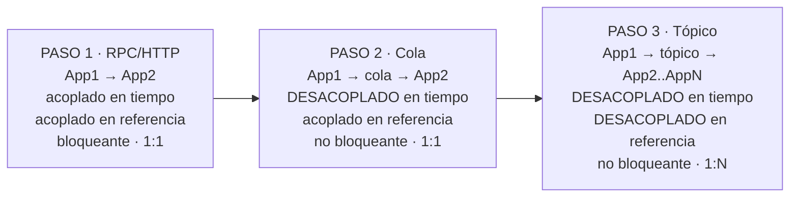

⚠️ **El matiz del paso 2 (el acoplamiento referencial de la cola).** La lámina 4 del deck MOM dice que en MOM *"el productor solo conoce la cola/tópico, no al consumidor"*, y la lámina 6 dice que en colas *"el productor conoce el nombre de la cola destino"*. Las dos cosas son ciertas: con una cola, el productor **nombra un destino** (la cola de pagos), aunque no sepa qué proceso concreto la atiende. Con un tópico, ni siquiera nombra un destino, publica un **tema**. Por eso en la progresión de la clase la cola queda "acoplada en referencia" y el tópico no. En el parcial, **sigue la progresión de la clase**, y si la pregunta es abierta, explica el matiz.

🖊️ En tus apuntes del 18/09 quedó otra distinción que Álvaro conectó con esto: *"multicast: se suscriben a la cola; broadcast: para todos"*. Un tópico hace **multicast** (solo a los suscritos); una colectiva de MPI hace **broadcast** (a todos los procesos del comunicador). Vuelve en la sección 6.10.

## 3.11 Estandarización y protocolos 🎯

| JMS (Java Message Service) | AMQP (Advanced Message Queuing Protocol) |
|---|---|
| **API** estándar del ecosistema Java (Java EE / Jakarta EE) | **Protocolo de red** abierto y estandarizado |
| Define colas y tópicos de forma unificada | Interoperabilidad real entre implementaciones de broker distintas |
| Implementada por ActiveMQ, IBM MQ; RabbitMQ la soporta con plugins | Enrutamiento flexible con exchanges |
| ⚠️ **No garantiza interoperabilidad** entre brokers distintos | RabbitMQ es la implementación de referencia más usada |

⚠️ **La pregunta trampa segura:** *"¿JMS garantiza que un productor en ActiveMQ y un consumidor en IBM MQ se entiendan?"* **No.** JMS estandariza cómo **programas** en Java, no qué bytes viajan por la red. AMQP estandariza **los bytes**, y por eso sí interopera. Analogía: JMS es como JDBC (misma API para bases distintas, que no se hablan entre sí); AMQP es como HTTP.

➕ Precisión fina: el modelo de exchanges es de **AMQP 0-9-1**, el que usa RabbitMQ clásicamente. **AMQP 1.0** (el estándar ISO) es otro protocolo que no define exchanges. RabbitMQ 4 soporta ambos.

**Protocolos ligeros** (lámina 11):

| Protocolo | Tipo | Para qué |
|---|---|---|
| **MQTT** | Binario, muy ligero, pub/sub | **Estándar de facto en IoT** (Mosquitto, HiveMQ, EMQX) |
| **STOMP** | Texto simple, parecido a HTTP | Clientes livianos o scripts |
| **XMPP** | Extensible, basado en **XML** | Nació para mensajería instantánea; presencia y pub/sub |

➕ MQTT trae tres niveles de calidad de servicio que son exactamente las semánticas de la sección 1.7: **QoS 0** = *at most once*, **QoS 1** = *at least once*, **QoS 2** = *exactly once* entre cliente y broker (con un intercambio de cuatro mensajes).

## 3.12 Garantías de entrega y *acks* ➕

El problema de fondo es el mismo de RPC: ¿cuándo puede el broker **borrar** un mensaje?

- Si lo borra **al entregarlo** y el consumidor se cae procesándolo, el mensaje **se pierde** (*at most once*).
- Si lo borra **cuando el consumidor confirma** (*ack*) y el consumidor se cae **después de procesar pero antes de confirmar**, el broker lo reenvía y se procesa **dos veces** (*at least once*).

La industria elige casi siempre la segunda y hace que el consumidor sea **idempotente** (procesar dos veces deja el mismo estado, por ejemplo guardando el ID de cada mensaje ya procesado). Y para mensajes que fallan una y otra vez existe la **cola de mensajes muertos** (*dead letter queue*): se apartan para revisión en vez de bloquear la cola.

## 3.13 Implementaciones en 2026 y Kafka contra RabbitMQ 🎯

1. **RabbitMQ:** broker AMQP de propósito general; colas, fanout, topics. *El que usarán en el laboratorio.*
2. **Apache Kafka:** log distribuido de eventos, streaming de alto volumen y *replay*.
3. **ActiveMQ / Artemis:** broker JMS clásico del ecosistema Java.
4. **AWS SQS/SNS, GCP Pub/Sub, Azure Service Bus:** MOM administrado por el proveedor.

| | RabbitMQ | Apache Kafka |
|---|---|---|
| Modelo | Broker de colas tradicional (AMQP) | **Log distribuido** de eventos, particionado |
| Orden garantizado | Por cola | **Por partición** |
| Retención | El mensaje **se borra al confirmar** (ack) | Se **retiene** por tiempo configurable: permite *replay* |
| Entrega | **Push** hacia el consumidor | **Pull**: el consumidor controla su *offset* |
| Caso típico | Colas de tareas, RPC-like, enrutamiento complejo | Streaming, *event sourcing*, pipelines de datos |

➕ **Lo que hay que entender de Kafka para que la tabla tenga sentido.** Un tópico de Kafka es un **archivo de solo-agregar** partido en particiones. Nadie borra al leer: cada consumidor guarda **hasta dónde leyó** (su *offset*). Por eso puede releer el pasado (*replay*): basta con mover el offset hacia atrás. Es como la diferencia entre un buzón (RabbitMQ: sacas la carta y ya no está) y un periódico archivado (Kafka: cada lector lleva su marcador de página).

⚠️ **¿Kafka es cola o tópico?** Las dos cosas. Dentro de un **grupo de consumidores**, cada partición la lee un solo miembro: se comporta como **cola** (reparte trabajo). Entre **grupos distintos**, cada grupo recibe todo: se comporta como **tópico** (difunde). Y el orden solo se garantiza **dentro de una partición**, no en el tópico entero.

## 3.14 RabbitMQ hoy: *quorum queues* y Raft 🎯➕

De la lámina 14:
- **RabbitMQ 4.0 (2024) eliminó las colas clásicas espejadas** (*classic mirrored queues*) como mecanismo de alta disponibilidad.
- El reemplazo y estándar recomendado son las **Quorum Queues**.
- Replican el log de la cola entre varios nodos usando el algoritmo de consenso **Raft**.
- Un **líder** replica cada entrada a los **seguidores**; la entrada **se confirma cuando la mayoría (quórum) la persiste**.
- Si un nodo cae, el resto conserva quórum y la cola sigue disponible **sin pérdida de mensajes confirmados**.

➕ **La aritmética del quórum**, que es lo calculable del tema: con **N** nodos, el quórum es la mayoría, `⌊N/2⌋ + 1`, y el sistema tolera **f** caídas si `N = 2f + 1`.

| Nodos | Quórum | Caídas toleradas |
|---|---|---|
| 3 | 2 | 1 |
| 4 | 3 | **1** (igual que con 3) |
| 5 | 3 | 2 |
| 7 | 4 | 3 |

⚠️ Por eso los clústeres de quórum se configuran con un número **impar** de nodos: pasar de 3 a 4 cuesta un nodo más y **no tolera ni una caída adicional**.

## 3.15 MOM administrado en la nube 🎯

AWS SQS (colas) y SNS (pub/sub); GCP Pub/Sub; Azure Service Bus (con AMQP nativo); Confluent Cloud (Kafka administrado por sus creadores).

🎯 El *trade-off* central: **operar tu propio broker** da control fino (enrutamiento, latencia, costo a escala); **un servicio administrado** da cero carga operativa. *"La decisión rara vez es técnica pura; también es de equipo y de madurez operativa."*

## 3.16 Regla de decisión: ¿RPC, cola o tópico? ⭐

Tres preguntas, en este orden:

1. **¿Necesito la respuesta ya para continuar?** → **RPC / gRPC**. (Validar un pago antes de mostrar "aprobado".)
2. **¿Es trabajo que alguien, cualquiera, tiene que hacer una vez?** → **Cola**. (Generar la factura en PDF; transcodificar un video.)
3. **¿Es un hecho que a varios les interesa?** → **Tópico**. (Se creó un pedido: lo quieren inventario, correo y analítica.)

| Escenario | Respuesta | Por qué |
|---|---|---|
| El cliente consulta su saldo | RPC | Necesita el dato para continuar |
| Enviar 10.000 correos de una campaña | Cola compartida | Trabajo repartible entre varios *workers* |
| "Usuario registrado" debe llegar a correo, CRM y analítica | Tópico | Un evento, varios interesados independientes |
| Sensores IoT publicando temperatura | Tópico (MQTT) | Muchos productores, consumidores por interés |
| Reprocesar los eventos de ayer con un algoritmo nuevo | Kafka | Solo un log retenido permite *replay* |
| Microservicio interno que calcula precios en 5 ms | gRPC | Síncrono, tipado y rápido |

---

# 4. Arquitecturas Peer-to-Peer

## 4.1 De Cliente/Servidor a P2P 🎯

- RPC/gRPC mostró una interacción típica C/S: un cliente invoca un servicio remoto.
- **P2P no reemplaza a C/S**: propone otra organización de roles, recursos y responsabilidades.
- Un **peer** (par) es un nodo que puede **consumir y ofrecer** servicios; los roles cambian según la interacción.
- ⚠️ *"P2P describe la organización del sistema, no un protocolo de transporte específico."* Dos peers pueden hablar por TCP, HTTP, RPC o gRPC.

| | Cliente/Servidor | P2P |
|---|---|---|
| Responsabilidades | Centralizadas | Distribuidas entre participantes |
| Roles | Estables | Potencialmente simétricos, cambian por interacción |
| Punto único de fallo | El servidor | En principio no hay (salvo en los híbridos) |
| Capacidad | Fija: la del servidor | **Crece con los usuarios**: cada peer que llega también aporta |
| Control y consistencia | Fáciles | Difíciles |

🎯 *"En la práctica existen arquitecturas híbridas; no es una dicotomía absoluta."*

➕ La cuarta fila es la razón de existir de P2P. En C/S, mil usuarios más son mil cargas más para el mismo servidor. En P2P, mil usuarios más son también mil proveedores más. Es escalabilidad de tamaño resuelta por diseño, a cambio de perder control.

## 4.2 Red física y red superpuesta (*overlay*) 🎯

- Internet/IP proporciona la **conectividad**; el *overlay* define las **relaciones lógicas** entre peers.
- Cada peer conoce solo **un subconjunto** de participantes, no toda la red.
- La topología del overlay **puede ser distinta** de la topología IP subyacente.

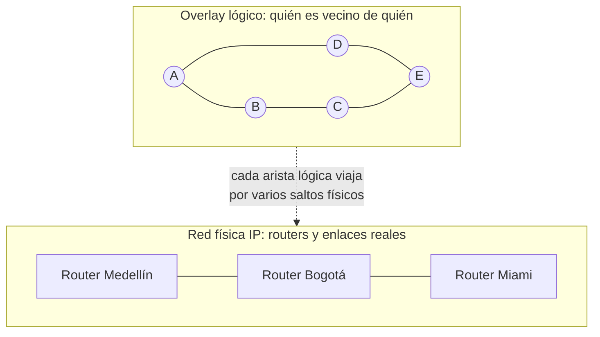

⚠️ Consecuencia que suelen preguntar: dos peers **vecinos en el overlay** pueden estar en continentes distintos, y dos peers en la misma ciudad pueden estar a muchos saltos lógicos. Un salto en el overlay **no es** un salto de red.

## 4.3 Los tres problemas de toda red P2P 🎯

| # | Problema | Pregunta |
|---|---|---|
| 1 | **Membresía** | ¿Cómo descubre un peer a otros y cómo se mantiene el overlay? |
| 2 | **Localización** | ¿Cómo encuentra un recurso, o al peer responsable de él? |
| 3 | **Transferencia** | ¿Cómo obtiene el recurso una vez localizado? |

Úsalos como plantilla para cualquier pregunta abierta sobre un sistema P2P: "BitTorrent resuelve la membresía con X, la localización con Y y la transferencia con Z".

## 4.4 Estructurado, no estructurado e híbrido 🎯

| Tipo | Organización | Búsqueda | Ejemplo |
|---|---|---|---|
| **Estructurado** | Reglas **deterministas** | Por la regla: se sabe dónde está cada clave | DHT, **Chord** |
| **No estructurado** | Enlaces **libres** | *Flooding*, *random walks* o superpeers | Gnutella |
| **Híbrido** | Componentes centrales o jerarquías + transferencia entre peers | Índice o superpeer | Napster, BitTorrent con *tracker* |

## 4.5 No estructurado: búsqueda por *flooding* 🎯

- La consulta se **reenvía a los vecinos**, que la reenvían a los suyos, hasta encontrar el recurso o alcanzar un límite.
- **TTL** (*time to live*) y **Query ID** limitan la propagación y los duplicados.
- Ventaja: **simplicidad**. Costo: **tráfico elevado y cobertura no garantizada**.

➕ **Para qué sirve cada mecanismo.** El **TTL** es un contador que baja en cada salto; en 0 la consulta muere, y eso **acota el radio**. El **Query ID** es un identificador único de la consulta; cada peer recuerda los que ya vio y descarta repeticiones, y eso **evita los ciclos** (en un grafo con ciclos, sin él, la misma consulta daría vueltas indefinidamente).

➕ **La cuenta del costo.** Si cada peer tiene 4 vecinos y el TTL es 3, en el peor caso: salto 1, 4 mensajes; salto 2, cada uno reenvía a sus otros 3 vecinos, 12; salto 3, 36. **Hasta 52 mensajes por una sola búsqueda**, y crece exponencialmente con el TTL. Si el archivo estaba a 4 saltos, no se encuentra aunque exista: esa es la "cobertura no garantizada".

➕ **Random walk:** en vez de preguntar a todos, se pregunta a **un** vecino al azar, que pregunta a otro al azar. Muchísimos menos mensajes, a cambio de más tiempo y menor probabilidad de éxito.

## 4.6 Híbrido: superpeers e índices centrales 🎯

- **Superpeer:** algunos peers (los más estables y con mejor conexión) asumen más responsabilidad de indexación o enrutamiento.
- **Índice central:** un servidor **localiza** recursos aunque los datos permanezcan en los peers.
- 🎯 *"Centralizar coordinación simplifica búsqueda, pero reintroduce dependencias críticas."*
- 🎯 La etiqueta del diagrama: **control ≠ datos**.

➕ Ese "control ≠ datos" es la idea más reutilizable del deck. **Napster** tenía el índice central (el control) y la música viajaba entre usuarios (los datos). Por eso lo pudieron cerrar judicialmente: bastaba apagar el índice. Es la misma separación del portmapper (localiza, pero no atiende) y de un *tracker* de BitTorrent.

## 4.7 Estructurado: la tabla hash distribuida (DHT) 🎯

- Idea conceptual: **clave → nodo responsable → valor**.
- Nodos y claves se asignan a un **mismo espacio de identificadores** mediante hashing.
- Objetivo: localizar al responsable **eficientemente, sin que cada peer conozca toda la red**.

Es un diccionario (`clave → valor`) cuyas casillas están repartidas entre miles de máquinas, y cualquiera puede averiguar en pocos saltos qué máquina tiene qué casilla.

## 4.8 Chord 🎯➕

**Lo de la lámina:**
- Organiza los identificadores en un **espacio circular de m bits** (IDs de 0 a 2<sup>m</sup> − 1).
- Una clave **k** pertenece al **primer nodo cuyo ID es igual o sigue a k**: `successor(k)`.
- El **hashing consistente** limita la redistribución de claves cuando cambia la membresía.

El anillo de la lámina tiene los nodos **1, 4, 6, 8, 10, 12, 14**. Como el ID más alto posible es 15, es un anillo de **m = 4 bits** (16 posiciones).

### ¿Quién guarda cada clave?

| Clave | 0 | 2 | 5 | 7 | 9 | 11 | 13 | 15 |
|---|---|---|---|---|---|---|---|---|
| Nodo responsable | 1 | 4 | 6 | 8 | 10 | 12 | 14 | **1** |

⚠️ La clave 15 es la trampa: no hay nodo ≥ 15, así que **da la vuelta** y la guarda el 1. El anillo es circular.

### La tabla *finger*: cómo buscar en O(log N) ➕

(Esto casi seguro estaba en las láminas 12 a 17 que faltan.) Si cada nodo solo conociera a su sucesor, buscar sería recorrer el anillo: O(N) saltos. Chord le da a cada nodo **m atajos**: la entrada *i* de la tabla del nodo *p* apunta a `successor(p + 2^(i−1))`. Atajos a distancia 1, 2, 4, 8…: cada salto puede **recortar a la mitad** la distancia restante.

Calculadas para el anillo de la lámina:

| Nodo | i=1 (p+1) | i=2 (p+2) | i=3 (p+4) | i=4 (p+8) |
|---|---|---|---|---|
| 1 | succ(2)=4 | succ(3)=4 | succ(5)=6 | succ(9)=10 |
| 4 | succ(5)=6 | succ(6)=6 | succ(8)=8 | succ(12)=12 |
| 6 | succ(7)=8 | succ(8)=8 | succ(10)=10 | succ(14)=14 |
| 8 | succ(9)=10 | succ(10)=10 | succ(12)=12 | succ(0)=1 |
| 10 | succ(11)=12 | succ(12)=12 | succ(14)=14 | succ(2)=4 |
| 12 | succ(13)=14 | succ(14)=14 | succ(0)=1 | succ(4)=4 |
| 14 | succ(15)=1 | succ(0)=1 | succ(2)=4 | succ(6)=6 |

**Regla de búsqueda:** si la clave cae entre yo y mi sucesor, mi sucesor es el responsable. Si no, salto al **atajo más lejano que no se pase** de la clave.

**Ejemplo 1: el nodo 1 busca la clave 11.**
1. En el 1: su sucesor es 4, y 11 no está en (1, 4]. Sus atajos son 4, 4, 6, 10; el más lejano que no se pasa de 11 es el **10**.
2. En el 10: su sucesor es 12, y 11 **sí** está en (10, 12]. **Responsable: 12.** Dos saltos.

**Ejemplo 2: el nodo 12 busca la clave 5.** Atajos del 12: 14, 14, 1, 4. El más lejano sin pasarse de 5 (dando la vuelta) es el **4**. En el 4, su sucesor es 6 y 5 está en (4, 6]. **Responsable: 6.**

➕ Con N nodos, la búsqueda toma **O(log N)** saltos. Para un millón de nodos, unos 20.

### Por qué "consistente" ➕

Supón que entra un **nodo 9**. Solo cambia de dueño la clave 9, que antes era del 10: nada más se mueve. Si se va el nodo 6, sus claves (5 y 6) pasan al 8, y nada más se mueve. Con un hash ingenuo `clave mod N`, pasar de 7 a 8 nodos cambia de dueño **7 de cada 8 claves**; con hashing consistente, en promedio solo **1/N**. En un sistema donde los nodos entran y salen todo el tiempo, esa diferencia es la que lo hace viable.

## 4.9 P2P no elimina los problemas distribuidos 🎯

- **Churn:** los peers entran y salen continuamente (cada entrada o salida obliga a mover claves y actualizar tablas).
- **Fallos parciales:** un peer puede estar lento, aislado o caído, y no se distingue fácilmente cuál de los tres.
- **Seguridad y confianza:** los participantes no son necesariamente confiables. ➕ El ataque clásico es el **Sybil**: un atacante crea miles de identidades falsas para controlar una porción del anillo.
- **Consistencia, replicación, NAT/firewalls y observabilidad** siguen siendo retos. ➕ Un peer detrás de NAT no puede recibir conexiones entrantes sin técnicas de *hole punching* o un intermediario.

## 4.10 Dónde tiene sentido P2P 🎯➕

Distribución de contenido y archivos; computación voluntaria; comunicación y colaboración descentralizada; en general, sistemas donde **los participantes aportan recursos además de consumirlos**.

➕ **BitTorrent, el ejemplo completo con los tres problemas:**
- **Membresía:** un *tracker* (índice central) o, sin tracker, una DHT de la familia Kademlia.
- **Localización:** el tracker o la DHT dicen qué peers tienen el archivo.
- **Transferencia:** el archivo va en **piezas**, cada una bajada de un peer distinto y en paralelo; un peer comparte piezas mientras sigue bajando otras; y la política *tit-for-tat* le da prioridad a quien te da a ti, lo que castiga a quien solo descarga.

Es un **híbrido de manual**: control centralizado o estructurado, datos entre peers.

## 4.11 Cómo encajan C/S, RPC y P2P 🎯

- RPC/gRPC es un **mecanismo de invocación remota**; suele verse en C/S, pero no está limitado a esa arquitectura.
- C/S y P2P son **decisiones de organización arquitectónica**.
- P2P puede contener **interacciones C/S temporales** entre peers: cuando A le pide una pieza a B, en ese instante A es cliente y B servidor.
- La arquitectura adecuada depende de **control, escalabilidad, consistencia, disponibilidad, seguridad y operación**.
- 🎯 **No son excluyentes.**

---

# 5. Fundamentos del procesamiento distribuido

Esta sección es la teoría que Álvaro puso en el tablero alrededor de MPI. Es corta pero muy examinable, porque tiene fórmulas.

## 5.1 Qué es y cuándo vale la pena 🖊️🎙️

🖊️ Tu apunte del 16/09: **procesamiento distribuido = procesos coordinados en diferentes hosts.** Y la pregunta que Álvaro escribió debajo: *¿cuándo un SD?*

> **`t_proc >> t_comm`**: el tiempo de procesamiento debe ser mucho mayor que el de comunicación.

Si una tarea se calcula en 2 ms y enviarla a otra máquina cuesta 50 ms, distribuirla la **empeora**. Distribuir solo paga cuando cada trozo de trabajo es lo bastante grande para amortizar lo que cuesta mandarlo.

🎙️ **La granularidad**, con el ejemplo de los pintores que usa Álvaro: una pared que un pintor pinta en 4 horas, dos pintores la pintan en 2, cuatro en 1. ¿Un millón de pintores? No: se estorban, y coordinarlos cuesta más que pintar. El tamaño del trozo que recibe cada proceso se llama **grano**: **fino** (muchos trozos pequeños, mucha comunicación) o **grueso** (pocos trozos grandes, poca comunicación). El grano correcto depende del problema.

🎙️ Y la advertencia que repitió en dos clases: *"si en su PC se demora 5 minutos y en la nube, con 4 instancias, 5 horas, eso va a cárcel"*. Gastar presupuesto de nube para ir más lento es el error que el criterio `t_proc >> t_comm` existe para evitar.

## 5.2 Distribuido contra paralelo 🖊️🎯

Tu cuadro del 16/09, completado con las láminas 2 y 3:

| | Sistema Distribuido (SD) | Sistema Paralelo (SP) |
|---|---|---|
| Unidad de ejecución | **Procesos** | **Hilos** (*threads*) |
| Hardware | **Multicomputador** (varias máquinas) | **Multiprocesador** (un computador, varios núcleos) |
| Memoria | **Distribuida**: cada proceso tiene la suya | **Compartida**: todos los hilos ven la misma |
| Cómo se comparten datos | **Paso de mensajes** explícito | Leyendo y escribiendo variables comunes |
| Herramienta estándar | **MPI** | **OpenMP** |
| Tipo de máquina (lámina) | MPP (*massively parallel processor*), clúster | SMP (*symmetric multiprocessor*) |

🎯 Las dos son variantes **MIMD**: *"los sistemas paralelos MIMD presentan dos arquitecturas diferenciadas: memoria compartida y memoria distribuida. El modelo de memoria hace que la programación sea esencialmente diferente."* Otras opciones que nombra la lámina: UPC (Unified Parallel C), shmem (Cray) y, para tarjetas gráficas, **CUDA/OpenCL**.

## 5.3 Flynn y el término nuevo: SPMD 🎯🎙️

| Categoría de Flynn | Instrucciones | Datos | Ejemplo |
|---|---|---|---|
| SISD | Una | Uno | CPU secuencial clásica |
| **SIMD** | Una | **Múltiples** | GPU, instrucciones vectoriales |
| MISD | Múltiples | Uno | Prácticamente inexistente |
| **MIMD** | Múltiples | Múltiples | Multiprocesadores y multicomputadores |

🎯 La lámina 17: *"El modelo de paralelismo que implementa MPI es **SPMD**"*: **Single Program, Multiple Data**.

🎙️ Álvaro lo presentó como *"hoy apareció un término nuevo de la taxonomía de Flynn"* e insistió en la diferencia: **no es SIMD**.

⚠️ **SIMD contra SPMD, la trampa segura:**
- **SIMD** es hardware: **una misma instrucción** se ejecuta en el **mismo instante** sobre muchos datos. Todos van en paso sincronizado.
- **SPMD** es un modelo de programación: **el mismo programa** se lanza muchas veces, cada copia con **datos distintos**, y cada copia avanza **a su ritmo** y puede tomar ramas distintas del `if`. En un mismo instante, el proceso 0 puede estar en la línea 12 y el 3 en la 30.

➕ Por eso SPMD corre sobre hardware **MIMD**: cada proceso ejecuta sus propias instrucciones. Si una opción dice "MPI implementa el modelo SIMD", es falsa.

🎙️ Su ejemplo: *"el mismo programa; yo, proceso 1, del 1 al 100; yo, proceso 2, del 100 al 200; yo, proceso 3, del 200 al 300"*. Un solo ejecutable, y cada copia sabe qué le toca porque sabe **quién es** (su rango, sección 6.2).

## 5.4 Speedup y eficiencia 🖊️⭐

Tus apuntes del 23/09, ecuaciones 2 y 3:

$$S(n) = \frac{t_s}{t_p(n)} \qquad\qquad E(n) = \frac{S(n)}{n} = \frac{t_s}{t_p(n)\cdot n}$$

- **t<sub>s</sub>**: tiempo **serial** (secuencial, un solo proceso).
- **t<sub>p</sub>(n)**: tiempo **distribuido** con **n** procesos. (En tu apunte aparece como t<sub>t</sub>(n).)
- **n**: número de **unidades de ejecución** = procesos, que idealmente coincide con los núcleos o vCPU.

🎙️ *"¿Cómo sé si mejoré? ¿S tiene que ser menor, igual o mayor que 1?"* **Mayor que 1**; lo ideal, 🖊️ **S(n) >> 1**.

**Cómo interpretarlos:**

| Resultado | Significa |
|---|---|
| S < 1 | Distribuir **empeoró** (la comunicación se come la ganancia): "cárcel" |
| S = 1 | No ganaste nada |
| 1 < S < n | Mejora real, **sublineal**: el caso normal |
| S = n, E = 1 | Speedup **lineal**, eficiencia del 100%: el ideal |
| S > n, E > 1 | **Superlineal**: raro, sospechoso (ver abajo) |

**Ejemplo con datos reales** 🧪. La integral de la sección 7, con 2.000 millones de rectángulos, en una máquina con **2 vCPU**:

| n (procesos) | t<sub>p</sub>(n) | S(n) = 2,88 / t<sub>p</sub> | E(n) = S/n |
|---|---|---|---|
| 1 | 2,88 s | 1,00 | 100% |
| 2 | 1,45 s | **1,99** | **99%** |
| 4 (sobresuscrito) | 1,44 s | 2,00 | **50%** |
| 8 (sobresuscrito) | 1,46 s | 1,97 | **25%** |

Con 2 procesos casi se duplica: lineal. Con 4 y 8 **el speedup no sube**, porque solo hay 2 núcleos reales, y la eficiencia se desploma. Es la demostración numérica de 🖊️ *"cantidad de procesos = CPU"*.

⚠️ **El ejemplo de clase era superlineal.** 🎙️ Álvaro dijo: *"se demora 10 segundos con un core y con 4 cores 2 segundos, eso nos da 5"*. S = 5 con n = 4 da **E = 1,25**, más del 100%. Puede ocurrir en la vida real (cuando al partir los datos cada trozo cabe en la caché y el acceso se acelera), pero es la excepción. Si en un ejercicio te da S > n sin explicación, revisa las cuentas antes de celebrar.

## 5.5 Ley de Amdahl ⭐ (salió como pregunta 1 de un parcial anterior)

El speedup mide lo que **obtuviste**. Amdahl predice el **máximo posible** cuando una parte del programa no se puede paralelizar:

$$S(n) = \frac{1}{s + \dfrac{p}{n}}$$

**p** = fracción paralelizable, **s = 1 − p** = fracción secuencial, **n** = núcleos.

**El ejercicio real, resuelto:**

> *Un programa tiene Ts = 150 unidades. El 70% es perfectamente paralelizable. Para un speedup de 2,5, ¿cuántos cores?* A. 4 · B. 5 · C. 6 · **D. 7** · E. Otro

```
p = 0,7   s = 0,3   S = 2,5

2,5 = 1 / (0,3 + 0,7/n)
0,3 + 0,7/n = 1/2,5 = 0,4
0,7/n = 0,1
n = 7                          ✔ D
```

Verificación: con 7 núcleos, T = 150 × (0,3 + 0,1) = 60; y 150/60 = 2,5 exacto.

⚠️ **Dos trampas del mismo ejercicio.** El **150 no se usa**: es distractor puro. Y la respuesta intuitiva (4 o 5) es la que se marca por apuro y se falla. Trabaja con fracciones, no con tiempos.

**El techo:** cuando n → ∞, queda **S<sub>max</sub> = 1/s**. Con 30% secuencial, jamás pasarás de 1/0,3 = **3,33×**, compres los núcleos que compres.

**Amdahl y eficiencia juntos:** con p = 0,9 y n = 4, S = 1/(0,1 + 0,225) = **3,08** y E = 3,08/4 = **77%**. Con n = 100, S = 1/(0,1 + 0,009) = 9,17 y E = **9%**. Más núcleos, más speedup, pero cada núcleo rinde cada vez menos.

➕ **Gustafson, el contrapunto.** Amdahl fija el tamaño del problema. En la práctica, cuando hay más máquinas se resuelven problemas **más grandes** (más rectángulos, más píxeles), y la parte paralela crece mientras la secuencial no. Bajo ese supuesto el speedup sí escala casi linealmente. Mencionarlo demuestra que entiendes el supuesto oculto de Amdahl.

## 5.6 Metodología para diseñar un algoritmo distribuido 🖊️

Tu apunte del 23/09, *"Diseño de algoritmos distribuidos (MPI)"*:

1. **Entender el problema.**
2. **Diseñar e implementar la solución secuencial**, e **identificar oportunidades de concurrencia y paralelismo**.
3. **Diseñar con MPI** (paso 2 + MPI).
4. **Medir S(n) y E(n)**, donde n = cantidad de cores (vCPU) = procesos.
5. **Revisar:** si S(n) y E(n) no son los esperados, **volver al paso 3**.

🎙️ Álvaro fue enfático con el paso 2: *"cuando entiende el código secuencial, es que va a pasar al código con MPI; si no entiende el secuencial, le toca un curso de programación básica"*. Es la razón por la que el caso integral (sección 7) arranca con el código secuencial y sus bugs antes de tocar MPI.

## 5.7 "Tantas tareas como procesadores" y la dependencia de datos 🖊️🎙️

🖊️ Recuadrado en tu apunte del 18/09: **lo ideal es que haya tantas tareas como procesadores.** 🎙️ La analogía del supermercado: si llegan 5 clientes, lo ideal son 5 cajas abiertas; si llegan 50, 50 cajas. Ni cajeros ociosos ni filas.

🎙️ Pero en el ejemplo de la lámina 32 (`V(i) = V(i) * suma`) aparece el límite:

```c
sum = 0;
for (j = 0; j < N; j++) sum = sum + V[j];      /* tarea 1: sumar      */
for (i = 0; i < N; i++) V[i] = V[i] * sum;     /* tarea 2: multiplicar */
```

Hay dos tareas (🎙️ *"cada for es una tarea"*) y dos procesadores, pero **no se pueden hacer a la vez**: la segunda necesita `sum`, que la primera todavía no ha terminado. Eso es una **dependencia de datos**. 🎙️ *"La dependencia de datos es la mejor forma de procrastinar"*: un procesador trabaja y el otro espera.

➕ **La salida, que es la clave de MPI:** si no puedes repartir **tareas** distintas, reparte **datos**. Los dos procesadores hacen la tarea 1 sobre **mitades distintas** del vector, juntan las sumas parciales, y luego los dos hacen la tarea 2 sobre sus mitades. Eso es **paralelismo de datos**, y es exactamente lo que implementan los 8 pasos de la sección 6.11.

---

# 6. MPI: Message Passing Interface

## 6.1 Qué es 🎯

- El **estándar** de programación de sistemas de **memoria distribuida** mediante **paso de mensajes**.
- Básicamente, **una librería (grande) de funciones** de comunicación para enviar y recibir mensajes entre procesos. **Más de 320 funciones.**
- MPI indica **explícitamente** la comunicación entre procesos, es decir: **los movimientos de datos** y **la sincronización**.
- Gestiona los procesos **estáticamente** (número y asignación se fijan al lanzar). MPI-2 permite también crearlos **dinámicamente**.

⚠️ MPI es una **especificación**, no un programa. Las implementaciones son **Open MPI** (la que instalaron en clase), **MPICH** y otras. La lámina 38 menciona MPICH y LAM (LAM es histórica, se fusionó en Open MPI).

🎙️ **El proceso 0 es el director de orquesta.** Álvaro: *"el 0 nunca debe morir cuando está programando en MPI, porque está pendiente de repartir la tarea, mirar que la hagan y recolectar"*. Por convención el 0 hace la **entrada** (el `scanf`) y la **salida** (el `printf` final); los demás calculan. Es la estructura entrada, proceso, salida de cualquier programa, repartida.

## 6.2 Comunicador y rango 🎯🎙️🖊️

🖊️ *"MPI agrupa los procesos implicados en una ejecución paralela en **comunicadores**, y un comunicador agrupa procesos que pueden intercambiar mensajes."*

- El comunicador **`MPI_COMM_WORLD`** se crea **por defecto** y engloba **a todos** los procesos.
- 🎯 Los procesos del comunicador **no necesariamente están en el mismo nodo**.
- 🎯 *"Por facilidad al programar, los PID inician en 0 (no son los del SO)."*

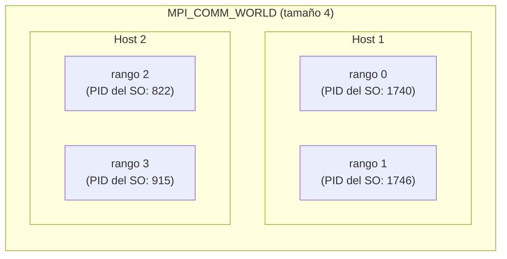

⚠️ **Dos "PID" distintos.** El **PID del sistema operativo** lo asigna el SO a su antojo (🎙️ Álvaro lo mostró con `ps`: salían 1740, 1546…). El **identificador MPI** va de **0 a n−1** dentro del comunicador. Las láminas le dicen `pid`; el nombre oficial en MPI es **rango** (*rank*). En el examen trátalos como sinónimos, pero no confundas ninguno de los dos con el PID del SO.

🎙️ Álvaro lo comparó con el código de estudiante: uno no escoge su número, la universidad lo asigna. El SO asigna el PID; MPI, en cambio, numera ordenado desde 0 **por comodidad del programador**.

## 6.3 Las seis funciones básicas 🎯🖊️

> *"Aunque MPI consta de más de 320 funciones, el núcleo básico lo forman sólo 6: 2 de inicio y finalización, 2 de control del número de procesos, 2 de comunicación."*

| Grupo | Función | Qué hace | Pregunta que responde |
|---|---|---|---|
| **Inicio y fin** | `MPI_Init(&argc, &argv)` | Primera función MPI del programa | |
| | `MPI_Finalize()` | Última función MPI del programa | |
| **Control** | `MPI_Comm_size(comm, &npr)` | Número de procesos del comunicador | 🖊️ **¿Cuántos somos?** |
| | `MPI_Comm_rank(comm, &pid)` | Identificador de este proceso | 🖊️ **¿Quién soy?** |
| **Comunicación** | `MPI_Send(...)` | Enviar | |
| | `MPI_Recv(...)` | Recibir | |

🎙️ **La herencia**, la analogía de Álvaro para las funciones de control: para repartir una herencia hay que saber **cuántos somos** (el tamaño) y **quién soy** (¿el hijo o el vecino?), porque de eso depende qué me toca. En MPI igual: con `size` sabes de qué tamaño es el trozo; con `rank`, cuál trozo es el tuyo.

🎙️ **Convención de nombres:** `MPI_` en mayúsculas, guion bajo, **primera letra de la función en mayúscula** y el resto en minúscula: `MPI_Init`, `MPI_Comm_rank`, `MPI_Finalize`. Siempre con `#include <mpi.h>`.

**El programa de clase** (`Practica.c`), anotado:

```c
#include <stdio.h>
#include <mpi.h>

int main(int argc, char **argv) {
    int A = 2, npr, pid;
    MPI_Init(&argc, &argv);                 /* INICIO: desde aquí, todo es distribuido */
    MPI_Comm_size(MPI_COMM_WORLD, &npr);    /* CONTROL: ¿cuántos somos? */
    MPI_Comm_rank(MPI_COMM_WORLD, &pid);    /* CONTROL: ¿quién soy?     */

    A++;                                    /* lo ejecutan TODOS los procesos */
    printf("Somos %d procesos y soy el proceso %d, y A=%d\n", npr, pid, A);

    MPI_Finalize();                         /* FIN */
    return 0;
}
```

🖊️ En tus apuntes del 18/09 están los números de línea del archivo de clase: **inicio y fin en las líneas 36 y 43**, **control en la 37 (cuántos) y la 38 (quién soy)**. Si en el parcial aparece un código con números de línea, así se identifican los tres bloques.

⚠️ **Lo que va entre `Init` y `Finalize` lo ejecutan todos los procesos**, salvo que un `if` sobre el rango diga lo contrario. 🎙️ *"Si no dice nada, todos los procesos hacen ese cuadrito."*

➕ **Valores de retorno.** Las funciones MPI devuelven un entero: **`MPI_SUCCESS`** si todo fue bien (lámina 12: *"≥ 0 ⇒ MPI_SUCCESS; < 0 ⇒ un error, MPI_ERR_ARG…"*). Y el programa termina con `return 0` por la razón que Álvaro mostró en consola 🖊️: **todo programa le devuelve un código al SO; 0 significa sin error.**

```bash
$ ls
$ echo $?        # 0: ls terminó bien
$ ls casita
$ echo $?        # 2: la carpeta no existe
```

## 6.4 Tipos de datos 🎯

🎙️ *"MPI es tipado. El receptor tiene que saber qué viaja por la red, porque si no, no sabe cómo interpretar los bits: pueden ser un entero, un float, una palabra."* Es el mismo problema de serialización de la sección 1.3.

| Tipo MPI | Tipo C |
|---|---|
| `MPI_CHAR` | `signed char` |
| `MPI_SHORT` / `MPI_INT` / `MPI_LONG` | `short` / `int` / `long` |
| `MPI_UNSIGNED_CHAR` / `MPI_UNSIGNED_SHORT` / `MPI_UNSIGNED` / `MPI_UNSIGNED_LONG` | sus versiones `unsigned` |
| `MPI_FLOAT` / `MPI_DOUBLE` / `MPI_LONG_DOUBLE` | `float` / `double` / `long double` |
| `MPI_BYTE` | bytes sin interpretar |
| `MPI_PACKED` | datos empaquetados con `MPI_Pack` |

⚠️ Errata de la lámina 8: dice `MPI_UNSIGNED_SHOT`. Es `MPI_UNSIGNED_SHORT`.

## 6.5 La receta: instalar, compilar, ejecutar 🎯🎙️🧪

Es la parte de infraestructura que Álvaro escribió como comentario arriba del código:

```bash
# 1. Instalar MPI en Ubuntu (como root: el prompt es #)
apt update
apt install openmpi-bin openmpi-doc libopenmpi-dev nano

# 2. Cambiarse a un usuario SIN privilegios (mínimo privilegio)
su - ubuntu

# 3. Crear/copiar/subir el código (el prompt ahora es $)
cd mpi
nano -w ej1.c

# 4. Compilar: mpicc en vez de gcc
mpicc ej1.c -o ej1

# 5. Ejecutar con distinta cantidad de unidades de ejecución
mpirun -np 4 ./ej1
```

🎙️ Detalles que corrigió en vivo y que pueden aparecer:
- El prompt `#` significa **root**; el `$` significa **usuario sin privilegios**. Instalar exige root; compilar y ejecutar se hace sin privilegios, por el **principio de mínimo privilegio**.
- Compilar es con **`mpicc`**; ejecutar es con **`mpirun`**. (En clase se escribió `mpicc` para ejecutar y lo corrigió.)
- ➕ `mpicc` no es un compilador nuevo: es `gcc` con las rutas de `mpi.h` y de la librería ya puestas. Por eso el código secuencial de la integral se compila con `gcc` y el distribuido con `mpicc`.
- El contenedor comparte la carpeta con un **volumen de Docker** (reconstruido de la grabación): `docker run -itd -v ~/mpi:/home/ubuntu/mpi ubuntu` y luego `docker exec -it <ID> bash`. 🎙️ El `bash` al final del `docker run` **sobra**.

### Slots y `--oversubscribe` 🧪

Con `-np 4` en una máquina de 2 núcleos, Open MPI **se niega**:

```
There are not enough slots available in the system to satisfy the 4
slots that were requested by the application
```

🎙️ Un **slot** es una unidad de ejecución disponible para MPI. El sistema se protege para que no lances 50.000 procesos con 2 procesadores. Si igual quieres más procesos que slots, lo autorizas explícitamente:

```bash
mpirun --oversubscribe -np 8 ./ej1
```

⚠️ Funciona, pero **no acelera nada**: la tabla de la sección 5.4 lo midió. Más procesos que núcleos solo reparte el mismo hardware en más pedazos.

### `--hostfile`: pasar de una máquina a un clúster 🎙️

Para usar varias máquinas, se le da a `mpirun` un archivo de texto con los nodos del clúster y cuántos slots aporta cada uno:

```text
# maquinas.txt
nodo1        slots=4
nodo2        slots=4
192.168.1.13 slots=4
```

```bash
mpirun --hostfile maquinas.txt -np 12 ./integral
```

🎙️ Su ejemplo: cuatro máquinas iguales de 28 núcleos, y a MPI se le ceden solo 4 de cada una. *"La idea es que usted no dedique todos los virtual CPU a MPI"*: el resto queda para el SO y otros servicios. Los nodos se pueden nombrar por nombre o por IP.

➕ La lámina 38 lista lo que exige un clúster: **un fichero con la lista de máquinas**, **daemons ejecutándose en cada máquina** y **el número de procesos** al lanzar (`mpiexec -n 8 pi`; `mpiexec` y `mpirun` son equivalentes en Open MPI).

## 6.6 Las cuatro conclusiones de la clase del 18/09 🖊️🎙️

Álvaro las sacó del ejemplo simple y dijo que la 2 y la 4 **son las valiosas**.

1. **El SO asigna los PID, y los procesos no salen en orden.** 🧪 Dos corridas seguidas con `-np 4` imprimieron `1, 3, 0, 2` y luego `2, 0, 1, 3`. El SO planifica los procesos cuando puede; no hay orden garantizado en la salida.
2. **Para ejecutar un programa se necesitan dos cosas: el ejecutable y los datos.** Con varias máquinas, eso obliga a **transferir archivos entre hosts**, y de ahí 🖊️ la **necesidad de un sistema de archivos distribuido (DFS) o de una carpeta compartida**. En el laboratorio se resuelve con volúmenes de Docker.
3. **Cada proceso puede tener una tarea diferente**, usando `if` sobre el rango (sección 6.7).
4. **Si se necesitan muchos procesos, se usan varios hosts: un clúster**, con una carpeta compartida entre los nodos. (El repositorio `hpc.docker` que mencionó monta un clúster de tres nodos.)

➕ La conclusión 2 es la razón por la que en HPC real todos los nodos montan el mismo sistema de archivos compartido (NFS u otro): si el ejecutable no está en la misma ruta en todos los nodos, `mpirun` no puede lanzarlo allá.

## 6.7 Ejercicios "¿qué imprime?" 🎯🎙️🧪

Álvaro los pregunta así en clase, y es el formato más probable de pregunta de código.

**Ejercicio 1.** El programa de clase (`A = 2; A++;`) con distintos `-np`. Salida real:

```
$ mpirun -np 1 ./ej1
Somos 1 procesos y soy el proceso 0, y A=3

$ mpirun -np 2 ./ej1
Somos 2 procesos y soy el proceso 0, y A=3
Somos 2 procesos y soy el proceso 1, y A=3
```

Todos imprimen **A = 3**, porque todos ejecutan `A++` sobre **su propia copia** de A. ⚠️ Nadie imprime 4 ni 5: cada proceso tiene su propio espacio de direcciones (lámina 17: *"cada proceso dispone de su propio espacio independiente de direcciones"*). No hay variable compartida.

**Ejercicio 2.** El de las láminas 14 y 15, con tareas diferentes. 🎙️ *"Si lo ejecuto con np 8, ¿cuánto vale A en el proceso 0, en el 1 y en el 5?"*

```c
if (pid == 0) A++;
if (pid == 1) A = 10;
printf("Proc. %d de %d activado, A = %d\n", pid, npr, A);
```

```
$ mpirun --oversubscribe -np 8 ./tareas
Proc. 3 de 8 activado, A = 2
Proc. 6 de 8 activado, A = 2
Proc. 7 de 8 activado, A = 2
Proc. 1 de 8 activado, A = 10
Proc. 2 de 8 activado, A = 2
Proc. 0 de 8 activado, A = 3
Proc. 5 de 8 activado, A = 2
Proc. 4 de 8 activado, A = 2
```

**P0 = 3, P1 = 10, P5 = 2.** 🎙️ *"Si no dice nada, en el proceso 5 queda la variable como estaba: 2."* Y el orden de las líneas es cualquiera (conclusión 1).

## 6.8 Comunicación punto a punto 🎯🎙️

🎯 *"La comunicación es un proceso cooperativo. Si una de las dos funciones no se ejecuta, la comunicación no tiene lugar (y podría producirse un deadlock)."* 🎙️ Tiene que estar **explícito en el código** quién envía (un `if` con `MPI_Send`) y quién recibe (otro `if` con `MPI_Recv`): la cola y la punta de la flecha.

```c
MPI_Send(&mess, count, type, dest,   tag, comm);
MPI_Recv(&mess, count, type, source, tag, comm, &status);
```

| Parámetro | En `Send` | En `Recv` |
|---|---|---|
| `&mess` | Dirección de lo que se envía | Dónde se guarda lo que llega |
| `count` | Cuántos elementos se envían | **Capacidad máxima** que se acepta |
| `type` | Tipo MPI (`MPI_INT`…) | Tipo MPI |
| `dest` / `source` | Rango destino | Rango origen (o `MPI_ANY_SOURCE`) |
| `tag` | Etiqueta de control, **0 a 32767** | Etiqueta esperada (o `MPI_ANY_TAG`) |
| `comm` | Comunicador | Comunicador |
| `&status` | | Información de control sobre lo recibido |

🎯 **`MPI_Recv` se bloquea hasta que llega el mensaje.**

**¿Para qué el `tag`?** 🎙️ Entre dos procesos puede haber **varias comunicaciones**, y el tag las distingue: *"tipo de mensaje, orden…"*. Por ejemplo, tag 0 para datos y tag 1 para la orden de terminar.

🎙️ **El `count` permite partir un vector.** Si el vector tiene 100 elementos y pones `count = 5`, se envían 5. Es la base de repartir trozos.

**¿Para qué el `status`?** 🎯 *"Información de control sobre el mensaje recibido."* Contiene quién lo envió (`status.MPI_SOURCE`), con qué tag (`status.MPI_TAG`) y, con `MPI_Get_count`, cuántos elementos llegaron realmente.

⚠️ **Precisión sobre el status.** 🎙️ En clase se explicó como protección contra pérdida de paquetes ("envía diez, llegan nueve"). En realidad **MPI garantiza entrega confiable y en orden** entre un mismo par de procesos. El status sirve para otra cosa: saber **de quién** y **con qué tag** llegó el mensaje cuando recibiste con `MPI_ANY_SOURCE` o `MPI_ANY_TAG`, y saber **cuántos** elementos llegaron, porque el `count` del `Recv` es un **máximo** y el emisor pudo mandar menos. (Si manda **más** de lo que cabe, es un error de truncamiento.) Para el examen, la definición de la lámina basta; esta precisión es por si la pregunta es abierta.

### El ejemplo completo (lámina 24) 🎯🧪

Es el primer programa con los tres grupos de funciones. El proceso 0 llena un vector con 0…9 y se lo envía al 1:

```c
for (i = 0; i < N; i++) VA[i] = 0;                 /* TODOS: vector en ceros */
if (pid == 0) {
    for (i = 0; i < N; i++) VA[i] = i;             /* P0: VA = 0..9 */
    MPI_Send(VA, N, MPI_INT, 1, 0, MPI_COMM_WORLD);
} else if (pid == 1) {
    printf("P1 antes de recibir: ");
    for (i = 0; i < N; i++) printf("%4d", VA[i]);  /* P1 imprime ANTES de recibir */
    printf("\n");
    MPI_Recv(VA, N, MPI_INT, 0, 0, MPI_COMM_WORLD, &info);
    MPI_Get_count(&info, MPI_INT, &ndat);
    printf("Datos de pr%d; tag = %d, ndat = %d\n", info.MPI_SOURCE, info.MPI_TAG, ndat);
    for (i = 0; i < ndat; i++) printf("%4d", VA[i]);
}
```

Salida real con `-np 4`:

```
P1 antes de recibir:    0   0   0   0   0   0   0   0   0   0
Datos de pr0; tag = 0, ndat = 10
   0   1   2   3   4   5   6   7   8   9
```

Las preguntas que hizo Álvaro sobre este código:
- **¿Qué imprime P1 primero?** 🎙️ **Ceros**, porque imprime su **propia** copia de `VA` antes de recibir. El `VA` de P0 vive en otra memoria.
- **¿Qué hace el proceso 3?** 🎙️ **Nada útil**: llena su vector con ceros y no entra a ningún `if`. (*"Como quien compra un libro y nunca lo lee."*)
- ⭐ **¿Qué hace el código? Responda en una frase.** 🎙️ Advirtió que la respuesta **no** es narrar el `for` línea por línea. La respuesta es: **"El proceso 0 envía al proceso 1 un vector de 10 enteros con los valores del 0 al 9, y el proceso 1 lo imprime."**

## 6.9 Modos de comunicación 🎯🎙️

Dos ejes independientes. 🎙️ Álvaro los despachó rápido porque *"ya lo vimos todo el curso"*: el **teléfono** (bloqueado hasta que se da la comunicación) contra el **correo electrónico** (sigo con lo mío y luego compruebo si llegó).

| | Qué significa |
|---|---|
| **Síncrona** | La comunicación no se produce hasta que emisor y receptor **se ponen de acuerdo** |
| **Con búfer** | El emisor deja el mensaje en un búfer y retorna; el búfer **no se puede reutilizar hasta que se vacíe** |
| **Bloqueante** | Se espera a que la comunicación se produzca |
| **No bloqueante** | Se retorna y se sigue; **más adelante se comprueba** si la comunicación ya se efectuó |

🎯 **La síncrona es siempre bloqueante.** La de búfer puede ser de las dos formas.

**Ventajas y costos** (lámina 21):

| Síncrona | Con búfer |
|---|---|
| **Más rápida** si el receptor está listo: **se ahorra la copia** en el búfer | El emisor **no se bloquea** si el receptor no está disponible |
| Además de intercambiar datos, **sincroniza** los procesos | Hay que hacer **copias** del mensaje: más lenta |
| ⚠️ Al ser bloqueante, **es posible un deadlock** | Hay que **gestionar búferes**; ¿se recibió? → hace falta un ACK |

🎙️ Por qué el búfer es más lento: la analogía del correo. Redactar un correo **ocupa espacio**, y un servidor de correo lo guarda **en disco**, que es mucho más lento que la RAM.

**Las variantes del envío** (lámina 25, completada):

| Función | Modo | Retorna cuando… |
|---|---|---|
| `MPI_Send` | Estándar | La implementación decide (ver el deadlock abajo) |
| `MPI_Ssend` | **Síncrono** | 🎯 **El receptor comenzó la lectura** |
| `MPI_Bsend` ➕ | Con búfer | El mensaje se copió a un búfer del usuario |
| `MPI_Isend` | **Inmediato** (no bloqueante) | 🎯 **De inmediato**; luego se comprueba |

Para completar un `MPI_Isend` (o `MPI_Irecv`): 🎯 **`MPI_Test`** devuelve 0 o 1 (¿ya terminó?, sin esperar) y **`MPI_Wait`** espera a que termine.

### ⚠️ El deadlock clásico 🧪

Dos procesos, y los dos hacen **primero `Send` y luego `Recv`**:

```c
MPI_Send(a, n, MPI_INT, otro, 0, MPI_COMM_WORLD);   /* los dos envían primero */
MPI_Recv(b, n, MPI_INT, otro, 0, MPI_COMM_WORLD, MPI_STATUS_IGNORE);
```

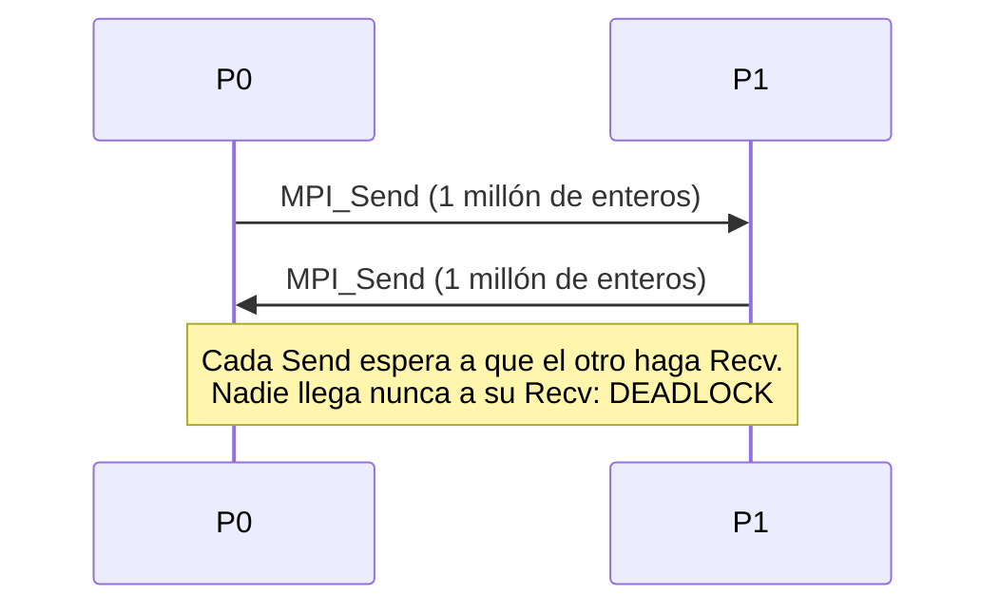

Lo ejecuté variando el tamaño del mensaje:

```
n=10 enteros:       terminó sin bloquearse
n=1000 enteros:     terminó sin bloquearse
n=1000000 enteros:  BLOQUEADO (deadlock, matado por timeout)
```

**¿Por qué con 10 funciona y con un millón no?** `MPI_Send` estándar, con mensajes pequeños, copia el mensaje a un búfer interno y retorna (se porta como **con búfer**). Con mensajes grandes no hay búfer suficiente y espera a que el receptor esté listo (se porta como **síncrono**). ⚠️ Es la peor clase de bug: **el código pasa las pruebas pequeñas y se congela en producción**.

**Las soluciones:** invertir el orden en uno de los dos (P0 envía y luego recibe; P1 recibe y luego envía); usar `MPI_Sendrecv`, que hace ambas cosas sin riesgo; o usar `MPI_Isend`/`MPI_Irecv` y luego `MPI_Wait`.

## 6.10 Comunicaciones colectivas 🎯🎙️🖊️

🎯 *"La comunicación es colectiva si participan en ella **todos** los procesos del comunicador."*

⭐ 🎙️ **Pregunta anticipada en clase, casi literal:** *"Las comunicaciones colectivas son: A. multicast, B. broadcast, C. …"*. La respuesta es **broadcast**. 🖊️ Tu apunte: *"multicast: se suscriben a la cola; broadcast: para todos"*. Una colectiva no la reciben solo los interesados: la ejecutan **todos** los procesos del comunicador, sin excepción.

**Características** 🎯:
- **Son bloqueantes.** 🖊️ Lo subrayaste en amarillo.
- **Todos los procesos del comunicador deben ejecutar la función.**
- Tres tipos: **1. movimiento de datos, 2. operaciones en grupo, 3. sincronización.**

⚠️ **El error más común con colectivas.** Poner el `MPI_Bcast` dentro de `if (pid == 0)`. El 0 lo llama, los demás no, y el 0 se queda esperando para siempre. **Todos** llaman a `MPI_Bcast` con la misma línea; el parámetro `root` es lo que decide quién envía y quién recibe.

➕ Precisión: "son bloqueantes" es cierto para MPI-1 y MPI-2, y es lo que se evalúa. Desde MPI-3 (2012) existen también versiones no bloqueantes (`MPI_Ibcast`, `MPI_Iallreduce`…).

### 1. Movimiento de datos

| Función | Qué hace | Antes → después (4 procesos) |
|---|---|---|
| **`MPI_Bcast`** | Envía el **mismo dato** del root a todos | P0: A → P0: A, P1: A, P2: A, P3: A |
| **`MPI_Scatter`** | **Reparte trozos** distintos del root | P0: ABCD → P0: A, P1: B, P2: C, P3: D |
| **`MPI_Gather`** | **Recolecta** un trozo de cada uno en el root | P0: A, P1: B, P2: C, P3: D → P0: ABCD |

```c
MPI_Bcast  (&mess, count, type, root, comm);
MPI_Scatter(envio, cuantos, tipo, recibo, cuantos, tipo, root, comm);
MPI_Gather (envio, cuantos, tipo, recibo, cuantos, tipo, root, comm);
```

🎙️ En el `Scatter`, **el root también se queda con un trozo** (la A) y trabaja: *"se queda con un pedazo, todos van a trabajar"*.

🎙️ **¿Por qué no repartir con `MPI_Send` en un bucle?** Porque `Send` es punto a punto: repartir a 10 procesos son 10 envíos **uno tras otro**. 🎯 El `Bcast` tiene *"implementación logarítmica en árbol"*: en la primera ronda el 0 envía al 1; en la segunda, 0 y 1 envían a 2 y 3; en la tercera, los cuatro envían a los otros cuatro.

| Procesos | Bucle de `Send` desde el root | Árbol (`MPI_Bcast`) |
|---|---|---|
| 8 | 7 envíos seguidos | **3 rondas** |
| 1.024 | 1.023 envíos seguidos | **10 rondas** |

### 2. Operaciones en grupo: reducción

🎯 **`MPI_Reduce`** (en árbol): combina un valor de cada proceso con una operación y deja el resultado **en el root**. P0: A, P1: B, P2: C, P3: D → P0: **A+B+C+D**.

🎯 **`MPI_Allreduce`**: igual, pero **todos** obtienen el resultado. Equivale a Reduce + Broadcast.

```c
MPI_Reduce   (&local, &total, 1, MPI_DOUBLE, MPI_SUM, 0, MPI_COMM_WORLD);
MPI_Allreduce(&local, &total, 1, MPI_DOUBLE, MPI_SUM,    MPI_COMM_WORLD);
```

**Operaciones predefinidas** (el estándar MPI):

| Operación | Constante |
|---|---|
| Suma, producto | `MPI_SUM`, `MPI_PROD` |
| Máximo, mínimo | `MPI_MAX`, `MPI_MIN` |
| Máximo o mínimo **y quién lo tiene** | `MPI_MAXLOC`, `MPI_MINLOC` |
| Lógicas | `MPI_LAND`, `MPI_LOR`, `MPI_LXOR` |
| A nivel de bits | `MPI_BAND`, `MPI_BOR`, `MPI_BXOR` |

⚠️ **No existe `MPI_AVG`.** 🎙️ En clase se mencionó "el promedio también" como operación reduce. Conceptualmente es una reducción (muchos valores → uno), pero MPI **no la trae predefinida**: se hace `MPI_Reduce` con `MPI_SUM` y el root divide entre `npr`.

🎙️ **El producto punto es una reducción:** dos vectores entran, un número sale. Y la integral de la sección 7 es exactamente un producto punto: base por altura, más base por altura…

### 3. Sincronización

🎯 **`MPI_Barrier(comm)`**: se bloquea hasta que **todos** los procesos del comunicador la ejecutan. Nadie pasa hasta que el último llega. Uso típico: arrancar un cronómetro con todos alineados (sección 7.5).

➕ Otras colectivas que conviene reconocer por nombre: **`MPI_Allgather`** (gather, y todos obtienen el resultado) y **`MPI_Alltoall`** (cada proceso envía un trozo distinto a cada uno de los demás).

### El patrón completo 🖊️🎙️

Tu dibujo del 16/09 (el trabajo 1 a 300 partido en 1–100, 101–200, 201–300) es el patrón canónico de MPI:


🎙️ *"Repartir, calcular, recoger; volver a repartir, recoger. Un programa MPI es muchas veces reparto y recojo."*

## 6.11 El ejemplo integrador: V(i) = V(i) × suma 🎯🧪

Los 8 pasos de la lámina 32, que resuelven la dependencia de datos de la sección 5.7:

| Paso | Qué | Función |
|---|---|---|
| 1 | Leer N (**solo P0**) | `if (pid == 0) scanf(...)` |
| 2 | Broadcast del tamaño local N/npr | `MPI_Bcast` |
| 3 | Repartir el vector | `MPI_Scatter` |
| 4 | Suma parcial local | `for` local |
| 5 | Todos obtienen la suma total | `MPI_Allreduce` con `MPI_SUM` |
| 6 | Multiplicar el trozo local por la suma | `for` local |
| 7 | Recolectar el vector | `MPI_Gather` |
| 8 | Imprimir (**solo P0**) | `if (pid == 0) printf(...)` |

⚠️ **¿Por qué `Allreduce` y no `Reduce` en el paso 5?** Porque en el paso 6 **todos** necesitan la suma para multiplicar su trozo. Con `Reduce`, solo el root la tendría y habría que hacer un `Bcast` adicional. Es el detalle que Álvaro remarcó en clase.

El código, probado con V = 1…8 y 4 procesos:

```c
if (pid == 0) {                                   /* 1 */
    N = 8;  V = malloc(N * sizeof(int));
    for (i = 0; i < N; i++) V[i] = i + 1;
    nloc = N / npr;
}
MPI_Bcast(&nloc, 1, MPI_INT, 0, MPI_COMM_WORLD);  /* 2 */
Vloc = malloc(nloc * sizeof(int));
MPI_Scatter(V, nloc, MPI_INT, Vloc, nloc, MPI_INT, 0, MPI_COMM_WORLD);  /* 3 */
for (i = 0; i < nloc; i++) sumloc += Vloc[i];     /* 4 */
MPI_Allreduce(&sumloc, &sum, 1, MPI_INT, MPI_SUM, MPI_COMM_WORLD);     /* 5 */
for (i = 0; i < nloc; i++) Vloc[i] *= sum;        /* 6 */
MPI_Gather(Vloc, nloc, MPI_INT, V, nloc, MPI_INT, 0, MPI_COMM_WORLD);  /* 7 */
if (pid == 0) { /* 8: imprimir V */ }
```

```
$ mpirun --oversubscribe -np 4 ./vsum
sum = 36
V = 36 72 108 144 180 216 252 288
```

La suma de 1 a 8 es 36, y cada elemento quedó multiplicado por 36. ⚠️ El código supone que **N es divisible por npr**. Con N = 10 y 4 procesos, `nloc = 2` y se perderían 2 elementos. En la sección 7 se resuelve el residuo.

---

# 7. Caso integral: calcular π con MPI

Es el ejercicio que ocupó la clase del 23/09 y que, según Álvaro, se usará para la **actividad sumativa 3** (MPI en clase). Aquí está completo: secuencial, bugs, pruebas, tiempos y versión MPI.

## 7.1 El problema 🎯🎙️

> *Calcular el área de la integral entre 0 y 1 de f(x) = 4/(1+x²). El programa debe pedir previamente la cantidad de intervalos (n).*

➕ El resultado exacto es **π**, porque la integral de 1/(1+x²) es arctan(x), y 4·(arctan 1 − arctan 0) = 4·(π/4) = π. Álvaro no lo dijo al principio a propósito: *"el ingeniero sabe para dónde va"*. Si tu programa da 0,06, sabes que está mal **sin mirar el código**.

🎙️ *"No lo vea como cálculo integral. Véalo como base por altura, más base por altura, más base por altura."*

- **Base:** igual para todos los rectángulos: **1/n**.
- **x** del rectángulo i: **x = i · base** (i = 0, 1, …, n−1).
- **Altura:** **f(x) = 4/(1+x²)**, cambia con cada rectángulo.
- **Área:** la suma de base × altura.

```c
base = 1./n;
for (i = 0; i < n; i++) {
    x = i * base;
    suma += base * 4 / (1 + x * x);
}
```

➕ Como f es **decreciente** en [0, 1] y la altura se toma en el **borde izquierdo** de cada rectángulo, cada rectángulo sobresale de la curva. Por eso el comentario del código dice *"sumas superiores"* y por eso el resultado siempre está **por encima** de π.

⚠️ **Choque de notación entre láminas.** En la 33, *m* es el total de intervalos y *n* los que le tocan a cada proceso (*n = m / cantidad de threads*). En la 34 y la 35, *n* es el **total**. Si una pregunta usa n, fíjate en cuál de las dos.

## 7.2 Pruebas unitarias 🎯🧪

🎙️ *"Para validar, siempre pida las pruebas unitarias: si entro 1 me da 4, está bueno; si entro 2, me da 3,6…"* Los valores de la lámina 35, recalculados:

| n | Lámina | Calculado | Error (resultado − π) |
|---|---|---|---|
| 1 | 4,0 | 4,000000 | 0,86 |
| 2 | 3,6 | 3,600000 | 0,46 |
| 3 | ⚠️ **3,4554** | **3,456410** | 0,32 |
| 5 | 3,3349 | 3,334926 | 0,19 |
| 10 | 3,2399 | 3,239926 | 0,098 |
| 100 | 3,1516 | 3,151576 | 0,010 |
| 1.000 | | 3,142592 | 0,0010 |

⚠️ **Errata de la lámina: con n = 3 es 3,4564, no 3,4554.** 🎙️ Álvaro lo corrigió en clase: *"ahí sí es el 64; voy a ponerle 64 para que le queden bien las pruebas unitarias"*.

Verifica n = 2 a mano, que es la que cabe en un parcial: base = 0,5; x = 0 → f = 4; x = 0,5 → f = 4/1,25 = 3,2; área = 0,5 × (4 + 3,2) = **3,6**.

➕ **Lo que dice la tabla:** el error se divide por 10 cada vez que n se multiplica por 10. Error proporcional a **1/n**. Para 9 decimales correctos hacen falta del orden de mil millones de rectángulos, y **esa** es la razón por la que el problema vale la pena distribuirlo.

➕ Si tomas la altura en el **punto medio** (`x = (i + 0.5) * base`), con n = 100 ya obtienes 3,1416009 (error 0,00001). La precisión mejora como 1/n², con el mismo costo. Es un buen detalle si te piden "¿cómo mejorarías el algoritmo antes de paralelizarlo?".

## 7.3 Los cuatro bugs 🎙️🧪⚠️

Álvaro dejó el código con bugs a propósito. Cada uno es una pregunta posible.

### Bug 1: división entera

La lámina 34 tiene `base= 1/n;`. En C, **entero entre entero da entero**: 1/2 = 0.

| n | Resultado con `1/n` |
|---|---|
| 1 | 4 (correcto de pura suerte: 1/1 = 1) |
| 2, 3, … | **0** (la base vale 0) |

🎙️ *"Voy a perder mi examen por un punto."* **Arreglo:** `base = 1./n;` o `base = (double) 1 / n;`. El punto convierte el 1 en real y la división pasa a ser real.

### Bug 2: la fórmula del comentario

La línea 4 del código de la lámina 34 dice `// f(x) = 4/(1*x^2)`. Es **`4/(1+x^2)`**. 🎙️ Lo corrigió en clase.

### Bug 3: `float` en lugar de `double`

🧪 Con `float suma` y n = 2.000 millones, el programa imprime:

```
float, n=2e9: 0.062500
```

🎙️ Álvaro obtuvo lo mismo en clase (*"me dio cero punto cero seis"*) y la reacción del ingeniero: *"ni por el diablo eso da 0,06"*.

**Por qué exactamente 0,0625.** Un `float` tiene 24 bits de mantisa (unos 7 dígitos decimales). Cerca de 0,0625, la distancia entre dos `float` consecutivos es de unos 7,5 × 10⁻⁹. Cada rectángulo aporta unos 2 × 10⁻⁹ (base de 5 × 10⁻¹⁰ por altura de hasta 4), **menos de la mitad de esa distancia**, así que `suma + aporte` se redondea de vuelta a `suma`. **La suma se congela** y los miles de millones de iteraciones restantes no le agregan nada. Un `double` tiene 53 bits (unos 16 dígitos) y no sufre esto.

🎙️ *"Su profesor de programación le dijo: póngalo float. Hay que poner la ciencia de tu lado: ¿cuál es el rango y la precisión del float y del double?"*

### Bug 4: el `n` del archivo no cabe en un `int` 🧪

El archivo `EjercicioIntegral.c` que tienes dice:

```c
int i, n;
n = 20000000000;      /* veinte mil millones */
```

El compilador lo advierte, y el programa imprime cero:

```
warning: overflow in conversion from 'long int' to 'int'
         changes value from '20000000000' to '-1474836480'
La suma es 0.000000
```

El `int` máximo es **2.147.483.647**. Veinte mil millones se desborda y **n queda negativo**: el `for` no se ejecuta ni una vez y la suma queda en 0. En clase se usó **2.000.000.000** (dos mil millones), que sí cabe, justo por debajo del límite. **Arreglo:** usar el valor de clase, o declarar `long long n, i;` (y `%lld` si se lee con `scanf`).

⚠️ Nota que dos mil millones está a solo un 7% del límite. Cualquiera que "pruebe con más rectángulos" lo rompe. Es una razón más para usar `long long`.

### Y un bug de medición

🎙️ Si el programa hace `scanf` de n y lo mides con `time`, **el tiempo que tardas en teclear cuenta**. Álvaro comentó el `scanf` y dejó n fijo en el código para medir solo el cálculo. La alternativa profesional es cronometrar **dentro** del programa (sección 7.5).

## 7.4 Medir el tiempo 🎙️🧪

```bash
$ time ./integral_sec
La suma es 3.141593

real    0m2.893s
user    0m2.851s
sys     0m0.000s
```

| Campo | Qué mide |
|---|---|
| `real` | Tiempo de reloj de pared, de principio a fin. **Es el que se usa en el speedup** |
| `user` | CPU gastada ejecutando **tu código** |
| `sys` | CPU gastada en el **núcleo del SO** a tu nombre (llamadas al sistema, E/S) |

🎙️ Álvaro lo explicó como: el tiempo de usuario es el que tu programa se demora calculando, y el del sistema es el del SO haciendo lo suyo (cambios de contexto entre procesos, entregar la salida).

➕ Con varios procesos, `user` puede ser **mayor** que `real`: es la suma de la CPU de todos los núcleos. Si `user ≈ 2 × real`, dos núcleos trabajaron a tope todo el tiempo.

⚠️ **Los tiempos dependen de la máquina y de cómo compilas.** En la sala, Álvaro midió entre 7 y 8,5 segundos. Aquí, el mismo código tarda 5,8 s compilado sin optimizar y 2,9 s con `gcc -O2`. Por eso el speedup se mide siempre **en la misma máquina y con las mismas opciones**. 🎙️ Su regla para el laboratorio: *"si con MPI se demora más de lo que se demoraba secuencial, cárcel"*.

## 7.5 La versión MPI 🎯🎙️🧪

Las láminas 36 y 37 no están en tu PDF. Esto es lo que Álvaro empezó a construir en clase, completado y probado.

**Las decisiones de diseño** (la parte que se evalúa, más que la sintaxis):

| Decisión | Qué se hace | Por qué |
|---|---|---|
| ¿Quién lee n? | 🎙️ **Solo P0** (`if (pid == 0)`), y luego `MPI_Bcast` | Si todos hicieran `scanf`, habría que teclearlo 4 veces |
| ¿Cómo se reparte? | **Por bloques**: cada proceso toma n/npr rectángulos contiguos | Es la figura de la lámina 33: un color por proceso |
| ¿Y si n no es divisible por npr? | El último proceso **absorbe el residuo** | Sin esto se pierden rectángulos |
| ¿Cómo se juntan? | `MPI_Reduce` con `MPI_SUM` hacia P0 | Muchas sumas locales → una suma total |
| ¿Quién imprime? | 🎙️ **Solo P0** | Si no, cada proceso imprime su suma parcial |
| ¿Cómo se mide? | `MPI_Barrier` y luego `MPI_Wtime` | Todos arrancan el cronómetro alineados; no se mide el teclado |

🎙️ Nota de la grabación: al código en construcción le faltaban **dos puntos y coma, en las líneas 13 y 33**. Si ves ese código en el parcial, búscalos.

```c
#include <stdio.h>
#include <mpi.h>

int main(int argc, char **argv) {
    int pid, npr;
    long long n = 0, i, ini, fin, trozo;
    double base, x, suma_local = 0.0, suma = 0.0, t0, t1;

    MPI_Init(&argc, &argv);                           /* inicio           */
    MPI_Comm_rank(MPI_COMM_WORLD, &pid);              /* ¿quién soy?      */
    MPI_Comm_size(MPI_COMM_WORLD, &npr);              /* ¿cuántos somos?  */

    if (pid == 0) n = 2000000000LL;                   /* solo P0 "lee" n  */
    MPI_Bcast(&n, 1, MPI_LONG_LONG, 0, MPI_COMM_WORLD);  /* todos conocen n */

    MPI_Barrier(MPI_COMM_WORLD);                      /* cronómetro alineado */
    t0 = MPI_Wtime();

    base  = 1.0 / n;
    trozo = n / npr;                                  /* rectángulos por proceso */
    ini   = pid * trozo;
    fin   = (pid == npr - 1) ? n : ini + trozo;       /* el último absorbe el residuo */
    for (i = ini; i < fin; i++) {
        x = i * base;
        suma_local += base * 4 / (1 + x * x);
    }

    MPI_Reduce(&suma_local, &suma, 1, MPI_DOUBLE, MPI_SUM, 0, MPI_COMM_WORLD);
    t1 = MPI_Wtime();

    if (pid == 0) printf("np=%d  suma=%.10f  tiempo=%.3f s\n", npr, suma, t1 - t0);
    MPI_Finalize();                                   /* fin */
    return 0;
}
```

```bash
mpicc -O2 integral_mpi.c -o integral_mpi
mpirun -np 2 ./integral_mpi
```

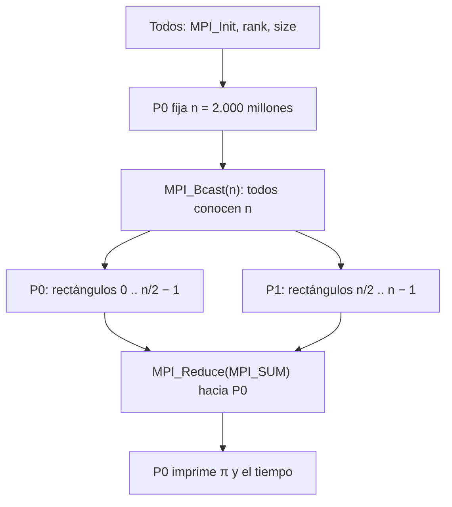

➕ **Alternativa: reparto cíclico.** En vez de bloques, cada proceso toma un rectángulo de cada npr:

```c
for (i = pid; i < n; i += npr) { ... }
```

El proceso 0 toma 0, 4, 8…; el 1 toma 1, 5, 9… No hay residuo que manejar, y si el costo por rectángulo fuera desigual, la carga quedaría mejor balanceada. Aquí todos cuestan lo mismo, así que los dos repartos rinden igual.

## 7.6 Resultados 🧪

En una máquina con **2 vCPU** (la tabla completa está en la sección 5.4):

```
np=1  suma=3.1415926541  tiempo=2.882 s
np=2  suma=3.1415926541  tiempo=1.445 s    → S = 1,99   E = 99%
np=4  suma=3.1415926541  tiempo=1.440 s    → S = 2,00   E = 50%   (sobresuscrito)
np=8  suma=3.1415926541  tiempo=1.456 s    → S = 1,98   E = 25%   (sobresuscrito)
```

**Cómo se interpreta, en el lenguaje del curso:**
1. Con np = 2, **S ≈ 2 y E ≈ 100%**: speedup casi lineal. El problema es ideal para distribuir: `t_proc >> t_comm` (cada proceso calcula mil millones de rectángulos y solo comunica **un** número al final).
2. Con np = 4 y 8 el speedup se **estanca en 2**: hay 2 núcleos. 🖊️ *"Cantidad de procesos = CPU."* Pasar de ahí solo baja la eficiencia.
3. Amdahl: la parte secuencial (Init, Bcast, Reduce, printf) es despreciable frente a 2.000 millones de iteraciones, así que p ≈ 1 y el techo está lejísimos. En este problema, **el límite es el hardware, no Amdahl**.

## 7.7 Los últimos decimales cambian con np 🖊️🧪

Imprimiendo 13 decimales:

```
secuencial:  3.1415926540900
np=1:        3.1415926540900
np=2:        3.1415926540899
np=3:        3.1415926540897
```

Es tu apunte del 14/08 en acción: **`0.1 + 0.2 + 0.3 ≠ 0.3 + 0.2 + 0.1`**. Con distinto np, los rectángulos se suman en grupos distintos y en otro orden, y la suma en punto flotante no es asociativa. La diferencia está en el decimal 13: no es un error del programa, es aritmética de máquina. ⚠️ Pero es la razón por la que **no se debe comparar con `==`** el resultado de un cálculo distribuido contra el secuencial: se compara con una tolerancia.

---

# 8. OpenMP y el modelo híbrido

El deck se llama `mpi-openmp`, pero de OpenMP solo dice una frase (🎯 *"para sistemas de memoria compartida tipo SMP, la herramienta más utilizada es OpenMP"*). Tu apunte del 16/09 lo pone en la fila de **SP: hilos, multiprocesos, OpenMP**. Esta sección es corta y sirve para las preguntas de comparación.

## 8.1 Qué es OpenMP ➕🧪

- Un conjunto de **directivas para el compilador** (`#pragma omp …`) sobre C, C++ o Fortran.
- Modelo **fork-join**: el programa corre con un hilo; al llegar a una región paralela **se bifurca** en varios hilos; al terminarla **se vuelven a unir**.
- Todos los hilos **comparten la memoria** del proceso: no hay mensajes, hay variables comunes.

La integral entera, en OpenMP, es **una línea** agregada al código secuencial:

```c
#pragma omp parallel for reduction(+:suma)
for (i = 0; i < n; i++) {
    double x = i * base;              /* x declarada adentro: cada hilo tiene la suya */
    suma += base * 4 / (1 + x * x);
}
```

```bash
gcc -O2 -fopenmp integral_omp.c -o integral_omp
OMP_NUM_THREADS=2 ./integral_omp
```

```
hilos=1  suma=3.1415926541  tiempo=2.888 s
hilos=2  suma=3.1415926541  tiempo=1.439 s
```

El mismo speedup que MPI con np = 2, sin `Init`, sin `Bcast`, sin `Reduce` explícito.

## 8.2 El precio de la memoria compartida: la condición de carrera 🧪

Quitando `reduction(+:suma)`, tres ejecuciones seguidas dieron:

```
sin reduction: suma=1.8545904380
sin reduction: suma=1.2870022206
sin reduction: suma=1.8545904380
```

Resultados **incorrectos y distintos** entre corridas. `suma += …` no es atómico: es leer, sumar y escribir. Dos hilos leen el mismo valor, cada uno suma lo suyo, y el que escribe de último **borra** el aporte del otro.

`reduction(+:suma)` le da a cada hilo **su propia copia privada** de `suma` y las combina al final. ⚠️ Es exactamente la idea de `MPI_Reduce`: sumas locales y una combinación final. En MPI no puede haber carrera sobre `suma` porque cada proceso **ya tiene** su propia memoria; en OpenMP hay que pedirlo.

## 8.3 MPI contra OpenMP

| | MPI | OpenMP |
|---|---|---|
| Unidad | Procesos | Hilos |
| Memoria | Distribuida (cada proceso la suya) | Compartida |
| Comunicación | Mensajes explícitos | Variables compartidas |
| Alcance | **Varias máquinas** (clúster) | **Una sola máquina** |
| Esfuerzo | Reescribir el programa (repartir, comunicar) | Anotar bucles con `#pragma` |
| Riesgo típico | Deadlock | Condición de carrera |
| Compilar / ejecutar | `mpicc` / `mpirun -np N` | `gcc -fopenmp` / `OMP_NUM_THREADS=N` |

## 8.4 El modelo híbrido ⚠️ (salió en un parcial anterior y se falló)

> *La combinación correcta de MPI con multithreading es:*
> A. Un hilo lanza múltiples procesos MPI
> **B. Cada proceso MPI lanza múltiples hilos** ✔
> C. Los procesos MPI reemplazan al multithreading lanzando un proceso MPI por cada core
> D. El código multithreading se intercambia entre los procesos MPI vía paso de mensajes

**El modelo híbrido:** un proceso MPI **por nodo** (o por socket), y dentro de cada proceso, **varios hilos** (OpenMP) que usan los núcleos de esa máquina. MPI se encarga de los mensajes **entre** nodos; los hilos aprovechan la memoria compartida **dentro** del nodo.

**Por qué C está mal aunque suene razonable:** un proceso MPI por núcleo **duplica los datos** en memoria tantas veces como núcleos haya, y obliga a **pasar mensajes entre procesos de la misma máquina** que podrían simplemente compartir memoria. Es pagar comunicación donde no hacía falta, violando `t_proc >> t_comm` sin necesidad.

➕ Es la tabla de la sección 5.2 aplicada en capas: **dentro** del nodo, memoria compartida (SP, OpenMP); **entre** nodos, memoria distribuida (SD, MPI). Para que funcione, MPI tiene cuatro niveles de soporte de hilos: `MPI_THREAD_SINGLE`, `FUNNELED` (solo el hilo principal llama a MPI), `SERIALIZED` (varios hilos, de a uno) y `MULTIPLE` (cualquier hilo, en cualquier momento).

---

# 9. Erratas y precisiones

Separadas en dos grupos, porque se tratan distinto en el examen. Una **errata** es un error: responde con el valor correcto. Una **precisión** es una simplificación de la lámina que no está mal para el nivel del curso: **responde con la lámina** y, si la pregunta es abierta, agrega el matiz.

## 9.1 Erratas (el material dice algo incorrecto)

| # | Dónde | Dice | Correcto | Verificado |
|---|---|---|---|---|
| 1 | MPI, lám. 35 | n = 3 → **3,4554** | **3,4564** | 🧪 y 🎙️ lo corrigió Álvaro |
| 2 | MPI, lám. 34, línea 4 | `f(x) = 4/(1*x^2)` | `4/(1+x^2)` | 🎙️ lo corrigió en clase |
| 3 | MPI, lám. 34, línea 15 | `base= 1/n;` | `base = 1./n;` (división entera da 0) | 🧪 bug deliberado |
| 4 | `EjercicioIntegral.c` | `n = 20000000000;` en un `int` | Desborda a −1.474.836.480 e imprime 0. Usar 2.000.000.000 o `long long` | 🧪 |
| 5 | MPI, lám. 8 | `MPI_UNSIGNED_SHOT` | `MPI_UNSIGNED_SHORT` | estándar MPI |
| 6 | Clase 18/09 | "El promedio" como operación reduce | No existe `MPI_AVG`: `MPI_SUM` y dividir entre npr | estándar MPI |
| 7 | Clase 16/09 | Ejecutar con `mpicc` | Se compila con `mpicc`, se ejecuta con `mpirun` | 🎙️ lo corrigió en clase |
| 8 | Código de la integral en clase | Faltan `;` en las líneas 13 y 33 | Agregarlos | 🎙️ |

## 9.2 Precisiones (la lámina simplifica)

| # | Dónde | Simplificación | Matiz |
|---|---|---|---|
| 1 | gRPC, lám. 15 | "Sin los problemas de acoplamiento" | Quita el de **plataforma y lenguaje**; mantiene el **temporal** (es síncrono) y el **de contrato** (`.proto`) |
| 2 | gRPC, lám. 16 | REST = HTTP/1.1 | REST también corre sobre HTTP/2. Y compara un **estilo** (REST) con un **framework** (gRPC) |
| 3 | gRPC, general | "Protobuf es binario, luego más pequeño" | 🧪 Con dos `double`, protobuf ocupa 18 bytes y el JSON 17. La ventaja es no parsear texto y el tipado |
| 4 | MOM, lám. 4 y 6 | La cola: ¿acoplada o no en referencia? | El productor nombra la **cola**, no al consumidor. En la progresión de clase: cola = acoplada en referencia; tópico = desacoplado |
| 5 | MOM, lám. 7 | Cola FIFO | FIFO al **salir de la cola**; con varios consumidores el **procesamiento** puede terminar en otro orden |
| 6 | MOM, lám. 13 | RabbitMQ borra al hacer ack | Cierto para colas clásicas; RabbitMQ Streams sí retiene y permite *replay* |
| 7 | Clase 18/09 (lám. 23) | El `status` protege de la pérdida de paquetes | MPI ya garantiza entrega confiable y en orden; el status dice **de quién**, **con qué tag** y **cuántos** llegaron |
| 8 | MPI, lám. 22 | Tag de 0 a 32767 | Es el **mínimo** que garantiza el estándar; las implementaciones admiten más |
| 9 | MPI, lám. 27 | Las colectivas son bloqueantes | Cierto en MPI-1/2 (lo que se evalúa). MPI-3 agregó versiones no bloqueantes (`MPI_Ibcast`…) |
| 10 | Apunte 18/09 | "Las colectivas son broadcast" | En el sentido de que **participan todos**. No todas mandan el mismo dato: `Scatter` manda trozos distintos y `Gather` va de muchos a uno |
| 11 | MPI, lám. 33 contra 34/35 | La letra *n* | En la 33, *n* = intervalos por proceso; en la 34 y 35, *n* = total |
| 12 | MPI, lám. 38 | Implementaciones libres: MPICH, LAM | LAM está descontinuada (se integró en Open MPI). Hoy: **Open MPI** y **MPICH** |
| 13 | Clase 23/09 | Ejemplo: 10 s con 1 core, 2 s con 4 → S = 5 | Es **superlineal** (E = 125%): posible por efectos de caché, pero excepcional. Si un ejercicio da S > n, revisa |
| 14 | Láminas MPI | Llaman `pid` al identificador | El nombre oficial es **rango** (*rank*); no es el PID del SO |

---

# 10. Preguntas tipo parcial, con respuesta y porqué

Intenta cada una antes de abrirla. Las marcadas con 🎙️ las anticipó Álvaro en clase casi textualmente.

## MPI

<details>
<summary><b>1. 🎙️ Las comunicaciones colectivas son: A. multicast · B. broadcast · C. punto a punto · D. ninguna</b></summary>

**B. Broadcast.** En una colectiva participan **todos** los procesos del comunicador, sin excepción. Multicast es para los que **se suscriben** (como un tópico de MOM). Tu apunte: *"multicast: se suscriben a la cola; broadcast: para todos"*.
</details>

<details>
<summary><b>2. 🎙️ Con <code>if(pid==0) A++; if(pid==1) A=10;</code>, A inicial 2 y <code>-np 8</code>: ¿cuánto vale A en P0, P1 y P5?</b></summary>

**P0 = 3, P1 = 10, P5 = 2.** Cada proceso tiene su propia copia de A. P5 no entra a ningún `if` y conserva el valor inicial. 🧪 Verificado.
</details>

<details>
<summary><b>3. 🎙️ ¿Qué hace el código de la lámina 24? Responda en una frase.</b></summary>

**"El proceso 0 envía al proceso 1 un vector de 10 enteros con los valores del 0 al 9, y el proceso 1 lo imprime."** No narres el `for`: di el **propósito**. Si preguntan por el proceso 3: no hace nada útil (solo llena su vector con ceros).
</details>

<details>
<summary><b>4. En ese mismo código, ¿qué imprime P1 antes del <code>MPI_Recv</code>?</b></summary>

**Diez ceros.** Imprime su propia copia de `VA`, que todos los procesos inicializaron en cero. El `VA` con 0…9 está en la memoria de P0 y todavía no ha llegado.
</details>

<details>
<summary><b>5. El modelo de paralelismo que implementa MPI es: A. SIMD · B. SPMD · C. MISD · D. SISD</b></summary>

**B. SPMD** (lámina 17). ⚠️ SIMD es el distractor: en SIMD todos ejecutan **la misma instrucción al mismo tiempo**; en SPMD todos ejecutan **el mismo programa**, cada uno a su ritmo y por ramas distintas del `if`, con datos distintos.
</details>

<details>
<summary><b>6. ¿Qué preguntas responden las funciones de control y cuáles son?</b></summary>

**¿Cuántos somos?** → `MPI_Comm_size`. **¿Quién soy?** → `MPI_Comm_rank`. Sirven para saber **qué trozo del trabajo le toca** a cada proceso (el tamaño del grano y cuál es el mío).
</details>

<details>
<summary><b>7. ¿Cuál es la diferencia entre <code>MPI_Ssend</code> y <code>MPI_Isend</code>?</b></summary>

`MPI_Ssend` es **síncrono**: no devuelve el control hasta que el receptor **comenzó la lectura**. `MPI_Isend` es **inmediato** (no bloqueante): retorna enseguida, y después se comprueba con `MPI_Test` (0 o 1) o se espera con `MPI_Wait`.
</details>

<details>
<summary><b>8. Dos procesos ejecutan cada uno <code>MPI_Send</code> al otro y luego <code>MPI_Recv</code>. Con mensajes pequeños funciona; con mensajes grandes se congela. ¿Por qué?</b></summary>

**Deadlock.** Con mensajes pequeños, `MPI_Send` copia a un búfer interno y retorna; con grandes, espera a que el otro haga `Recv`, y ninguno llega a su `Recv`. 🧪 Con 10 y 1.000 enteros terminó; con un millón se bloqueó. **Arreglo:** invertir el orden en uno, `MPI_Sendrecv`, o `MPI_Isend` + `MPI_Wait`.
</details>

<details>
<summary><b>9. En el ejemplo V(i) = V(i) × suma, ¿por qué el paso 5 es <code>MPI_Allreduce</code> y no <code>MPI_Reduce</code>?</b></summary>

Porque en el paso 6 **todos** multiplican su trozo por la suma. `Reduce` deja el resultado solo en el root; `Allreduce` (= Reduce + Bcast) lo deja en todos.
</details>

<details>
<summary><b>10. La combinación correcta de MPI con multithreading es… (salió en un parcial anterior)</b></summary>

**Cada proceso MPI lanza múltiples hilos.** Un proceso MPI por nodo; hilos dentro del nodo para usar la memoria compartida. "Un proceso MPI por core" es el distractor: duplica datos y paga mensajes entre procesos de la misma máquina.
</details>

<details>
<summary><b>11. <code>mpirun -np 4 ./ej1</code> en una máquina de 2 núcleos falla con "not enough slots". ¿Qué significa y qué opciones hay?</b></summary>

MPI no tiene 4 **slots** (unidades de ejecución) disponibles. Opciones: `--oversubscribe` (funciona, pero no acelera: 🧪 S se queda en 2) o `--hostfile` con más máquinas (clúster), que es lo que realmente agrega capacidad.
</details>

<details>
<summary><b>12. ¿Por qué ejecutar MPI en varios hosts evidencia la necesidad de un sistema de archivos distribuido?</b></summary>

Porque para ejecutar un programa se necesitan **el ejecutable y los datos**, y ambos tienen que estar en **cada** host. Sin una carpeta compartida (DFS, NFS o un volumen), habría que copiar los archivos a mano a cada nodo.
</details>

<details>
<summary><b>13. ¿Por qué repartir datos con <code>MPI_Scatter</code> y no con <code>MPI_Send</code> en un bucle?</b></summary>

El bucle hace los envíos **uno tras otro** desde el root: con 8 procesos, 7 envíos seguidos. Las colectivas se implementan **en árbol**: 3 rondas para 8 procesos, 10 rondas para 1.024.
</details>

<details>
<summary><b>14. ¿Existe <code>MPI_AVG</code>?</b></summary>

**No.** Las operaciones predefinidas son SUM, PROD, MAX, MIN, MAXLOC, MINLOC y las lógicas y de bits. El promedio se obtiene con `MPI_SUM` y dividiendo entre `npr`.
</details>

## Speedup, eficiencia y Amdahl

<details>
<summary><b>15. Un programa tarda 12 s secuencial y 4 s con 4 procesos. Calcule S(4) y E(4).</b></summary>

S = 12/4 = **3**. E = 3/4 = **75%**. Mejora real y sublineal.
</details>

<details>
<summary><b>16. Con 80% paralelizable y 4 núcleos, ¿qué speedup predice Amdahl? ¿Cuál es el máximo con infinitos núcleos?</b></summary>

S = 1/(0,2 + 0,8/4) = 1/0,4 = **2,5**. Máximo: 1/0,2 = **5**.
</details>

<details>
<summary><b>17. Ts = 150, 70% paralelizable, se quiere S = 2,5. ¿Cuántos cores? (parcial anterior)</b></summary>

0,3 + 0,7/n = 0,4 → **n = 7**. El 150 no se usa.
</details>

<details>
<summary><b>18. Si S(n) &lt; 1, ¿qué pasó y qué dice la metodología?</b></summary>

Distribuir **empeoró**: la comunicación pesa más que el cálculo (no se cumple `t_proc >> t_comm`, grano demasiado fino). Paso 5 de la metodología: **volver al paso 3** y rediseñar (trozos más grandes, menos comunicación, menos procesos).
</details>

## Caso integral

<details>
<summary><b>19. Con <code>base = 1/n;</code> el programa da 4 con n = 1 y 0 con n = 2. ¿Por qué?</b></summary>

**División entera:** en C, 1/2 = 0. Con n = 1 da 1/1 = 1 por casualidad. Arreglo: `1./n` o un cast a `double`.
</details>

<details>
<summary><b>20. Con <code>float</code> y 2.000 millones de rectángulos da 0,0625 en vez de π. ¿Por qué?</b></summary>

El `float` tiene unos 7 dígitos de precisión. Cuando la suma llega a 0,0625, cada aporte (≈ 2 × 10⁻⁹) es menor que la mitad de la distancia entre dos `float` consecutivos, y la suma **se congela**. Con `double` (unos 16 dígitos) no pasa.
</details>

## MOM

<details>
<summary><b>21. ¿Cuál NO es característica de un MOM? A. Store-and-forward · B. El productor se bloquea hasta que el consumidor procesa · C. Desacople en tiempo · D. El mensaje espera si el consumidor falla</b></summary>

**B.** Eso describe a RPC. En MOM el productor **continúa** sin esperar.
</details>

<details>
<summary><b>22. Hay que repartir 10.000 correos entre 5 workers, y además avisarles a inventario, facturación y analítica cada vez que se crea un pedido. ¿Qué modelo para cada cosa?</b></summary>

Correos: **cola compartida** (cada correo lo envía un solo worker, compiten). Pedido creado: **tópico** (los tres interesados reciben su copia).
</details>

<details>
<summary><b>23. ¿JMS garantiza interoperabilidad entre brokers de distintos fabricantes?</b></summary>

**No.** JMS es una **API** de Java, no un protocolo de red. **AMQP** sí, porque estandariza los bytes que viajan.
</details>

<details>
<summary><b>24. ¿Por qué Kafka permite <i>replay</i> y RabbitMQ (colas clásicas) no?</b></summary>

Kafka **retiene** los mensajes por tiempo configurable en un log, y cada consumidor controla su **offset**: basta con retrocederlo. RabbitMQ **borra** el mensaje cuando el consumidor confirma (ack).
</details>

<details>
<summary><b>25. Una quorum queue de RabbitMQ tiene 5 nodos. ¿Cuántas caídas tolera? ¿Y con 4?</b></summary>

Con 5: quórum 3, tolera **2**. Con 4: quórum 3, tolera **1** (igual que con 3). Por eso se usan números impares.
</details>

<details>
<summary><b>26. Una cola es FIFO. Con tres consumidores compartiendo la cola, ¿se garantiza que los mensajes se procesan en orden?</b></summary>

**No.** Salen en orden, pero cada consumidor tarda distinto, y si uno se cae sin confirmar, su mensaje se reentrega más tarde.
</details>

## gRPC

<details>
<summary><b>27. ¿Qué acoplamiento elimina gRPC respecto de RMI/CORBA, y cuál no?</b></summary>

Elimina el de **plataforma y lenguaje** (protobuf y HTTP/2 son neutrales). **No** elimina el **temporal**: sigue siendo petición-respuesta y el servidor tiene que estar vivo.
</details>

<details>
<summary><b>28. En <code>message HelloRequest { string name = 1; }</code>, ¿qué significa el 1?</b></summary>

Es el **número de campo**: la identidad del campo en el mensaje binario. No es un valor por defecto. En el cable no viaja "name", viaja el 1.
</details>

<details>
<summary><b>29. En SUN-RPC el cliente encontraba el puerto con el portmapper. ¿Y en gRPC?</b></summary>

No hay portmapper. El cliente conoce `host:puerto` de antemano (`localhost:50051`), o lo resuelve la infraestructura (DNS, *service discovery*).
</details>

<details>
<summary><b>30. ¿Por qué un navegador no puede llamar directamente a un servicio gRPC?</b></summary>

gRPC usa características de HTTP/2 (los *trailers*) que las APIs del navegador no exponen. Se necesita **gRPC-Web** con un proxy. Por eso la lámina dice que REST sigue siendo excelente para APIs públicas.
</details>

## P2P

<details>
<summary><b>31. En el anillo Chord de la lámina (nodos 1, 4, 6, 8, 10, 12, 14; m = 4), ¿qué nodo guarda la clave 11? ¿Y la 15?</b></summary>

Clave 11 → **nodo 12** (primer nodo ≥ 11). Clave 15 → **nodo 1** (no hay nodo ≥ 15, da la vuelta).
</details>

<details>
<summary><b>32. En flooding, ¿para qué sirven el TTL y el Query ID?</b></summary>

**TTL:** limita cuántos saltos viaja la consulta (el radio). **Query ID:** permite descartar la misma consulta si llega otra vez por otro camino (evita ciclos y duplicados).
</details>

<details>
<summary><b>33. ¿Qué significa "control ≠ datos" en un P2P híbrido? Dé un ejemplo.</b></summary>

La coordinación (índice, localización) está centralizada, pero los datos viajan directamente entre peers. Napster: índice central, música entre usuarios. BitTorrent con tracker: el tracker dice quién tiene el archivo, las piezas se bajan de los peers.
</details>

<details>
<summary><b>34. "Debemos elegir entre usar RPC o una arquitectura P2P." ¿Qué está mal en esta frase?</b></summary>

Mezcla categorías: RPC es un **mecanismo de comunicación** y P2P una **organización arquitectónica**. Dos peers pueden comunicarse por RPC. 🎯 *"No son excluyentes."*
</details>

---

*Guía construida sobre los decks 07 a 10 del curso, tus apuntes del 14/08 al 23/09, las grabaciones de clase de MPI del 16, 18 y 23 de septiembre, y DS4 (Tanenbaum y van Steen). Todo lo marcado con 🧪 se compiló y ejecutó con Open MPI, gcc y grpcio.*
